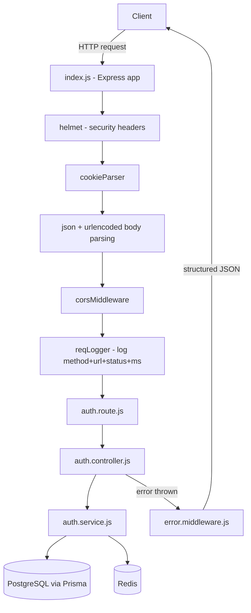
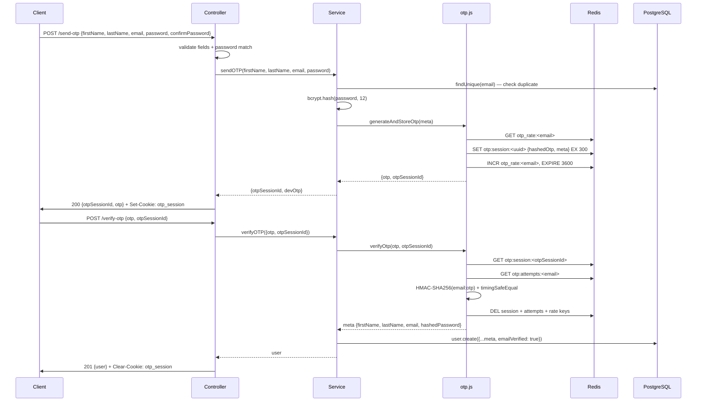
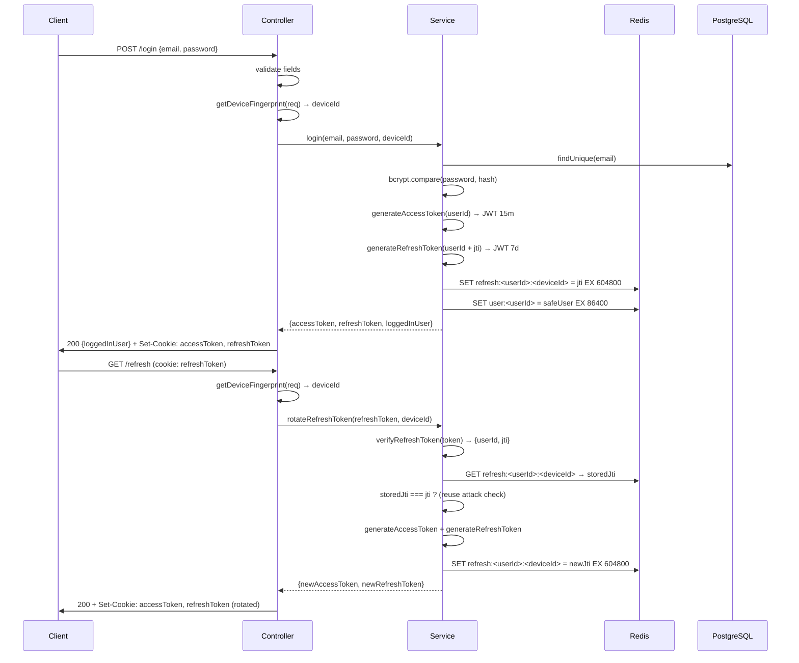

# User Service — Documentation Index

This is the `user-service` microservice of the IRCTC backend.

It handles user **registration**, **login**, and **token session management**.

---

## What this service does

- Registers new users via a two-step OTP email verification flow
- Authenticates users with bcrypt password check + JWT token issuance
- Manages multi-device sessions using device-bound refresh tokens
- Rotates access/refresh tokens on every refresh call
- Detects and blocks refresh token reuse attacks

## Technology stack

| Layer            | Technology                     |
| ---------------- | ------------------------------ |
| Runtime          | Node.js + Express              |
| Database         | PostgreSQL via Prisma ORM      |
| Cache / Sessions | Redis (ioredis)                |
| Passwords        | bcrypt (12 rounds)             |
| Auth tokens      | JSON Web Tokens (jsonwebtoken) |
| OTP hashing      | HMAC-SHA256 (Node.js `crypto`) |
| Logging          | Winston                        |
| Security headers | Helmet                         |
| Cookies          | httpOnly + secure + sameSite   |

---

## API routes at a glance

All routes are prefixed with `/api/v1/auth`.

| Method | Path          | Purpose                                          | Success Code |
| ------ | ------------- | ------------------------------------------------ | ------------ |
| `POST` | `/send-otp`   | Start registration — generate OTP                | `200`        |
| `POST` | `/verify-otp` | Complete registration — verify OTP + create user | `201`        |
| `POST` | `/login`      | Authenticate user, issue tokens                  | `200`        |
| `GET`  | `/refresh`    | Rotate access + refresh tokens                   | `200`        |
| `GET`  | `/health`     | Service health probe                             | `200`        |

---

## High-level request flow



---

## Documentation map

| File                              | What it covers                                                                                  |
| --------------------------------- | ----------------------------------------------------------------------------------------------- |
| `docs/README.md`                  | This index                                                                                      |
| `docs/status/README.md`           | What is built, what is pending, HTTP status code reference                                      |
| `docs/config/README.md`           | Config, logger, Prisma, Redis setup                                                             |
| `docs/middlewares/README.md`      | All middleware files explained                                                                  |
| `docs/utils/README.md`            | All utility helpers explained                                                                   |
| `docs/setup/README.md`            | Local setup guide (PostgreSQL, Redis, Prisma, run)                                              |
| `docs/setup/send-verify-otp.md`   | Deep dive: registration OTP flow                                                                |
| `docs/setup/login-and-refresh.md` | Deep dive: login + token rotation flow                                                          |
| `docs/concepts/authentication.md` | **Concepts guide**: Auth vs Authz, Sessions, JWT, OAuth 2.0, Google Sign-In — beginner friendly |

---

## Registration flow (two-step OTP)



---

## Login and token rotation flow



---

## Error response shape

All errors return a consistent JSON shape:

```json
{
  "success": false,
  "error": "ERROR_CODE",
  "message": "Human readable message"
}
```

See `docs/status/README.md` for the full status code and error code table.
