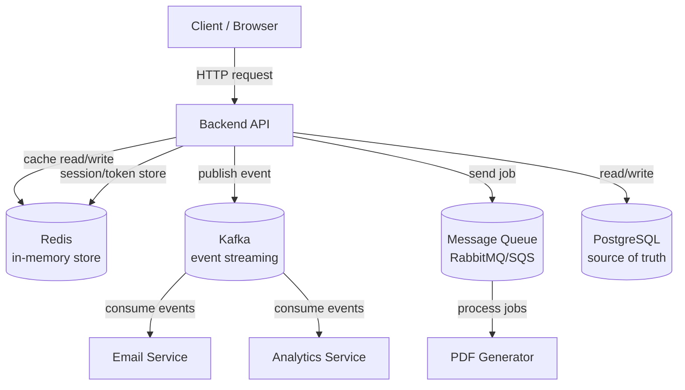

# Backend Concepts — Index

This folder contains deep, beginner-to-advanced explanations of the core backend concepts used in modern systems and microservices.

Each document is self-contained. They explain the **theory**, the **why**, real-world **examples**, **architecture diagrams**, **how to implement**, and **interview questions**.

---

## Reading order (recommended)

If you are a beginner, read in this order. Each builds on the previous one.

| #   | Document                               | What you learn                                   | Prerequisite             |
| --- | -------------------------------------- | ------------------------------------------------ | ------------------------ |
| 1   | [authentication.md](authentication.md) | Auth, sessions, JWT, OAuth, cookies              | Basic HTTP               |
| 2   | [message-queues.md](message-queues.md) | Why async messaging exists, queue fundamentals   | Basic backend            |
| 3   | [pub-sub.md](pub-sub.md)               | Publish/Subscribe pattern, event-driven design   | Message queues           |
| 4   | [redis.md](redis.md)                   | In-memory data store, caching, sessions, pub/sub | Basic data structures    |
| 5   | [kafka.md](kafka.md)                   | Distributed event streaming at scale             | Message queues + pub/sub |

---

## Quick mental map of where each technology fits

---

## One-line summary of each concept

| Concept           | One-line summary                                                                                   |
| ----------------- | -------------------------------------------------------------------------------------------------- |
| **Message Queue** | A buffer that holds tasks so they can be processed later by workers, one consumer per message      |
| **Pub/Sub**       | Broadcast a message to many subscribers at once — sender doesn't know who listens                  |
| **Redis**         | A super-fast in-memory database used for caching, sessions, rate limiting, and lightweight pub/sub |
| **Kafka**         | A distributed, durable log of events that can be replayed — built for massive scale streaming      |

---

## How these relate to this project

This `user-service` already uses **Redis** for:

- OTP session storage
- Rate limiting
- Refresh token (JTI) storage
- User profile caching

In a full IRCTC-style system, you would add **Kafka** or a **message queue** for:

- Sending OTP emails asynchronously (don't block the API response)
- Booking confirmation notifications
- Payment event processing
- Analytics / audit logging
- Inter-service communication (user-service → booking-service → payment-service)
