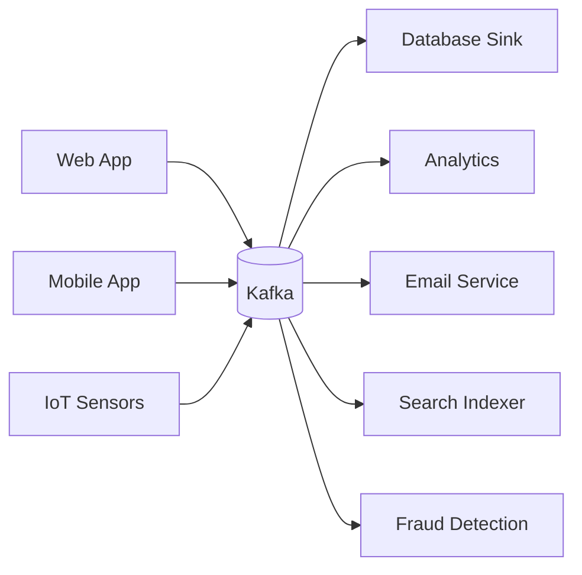
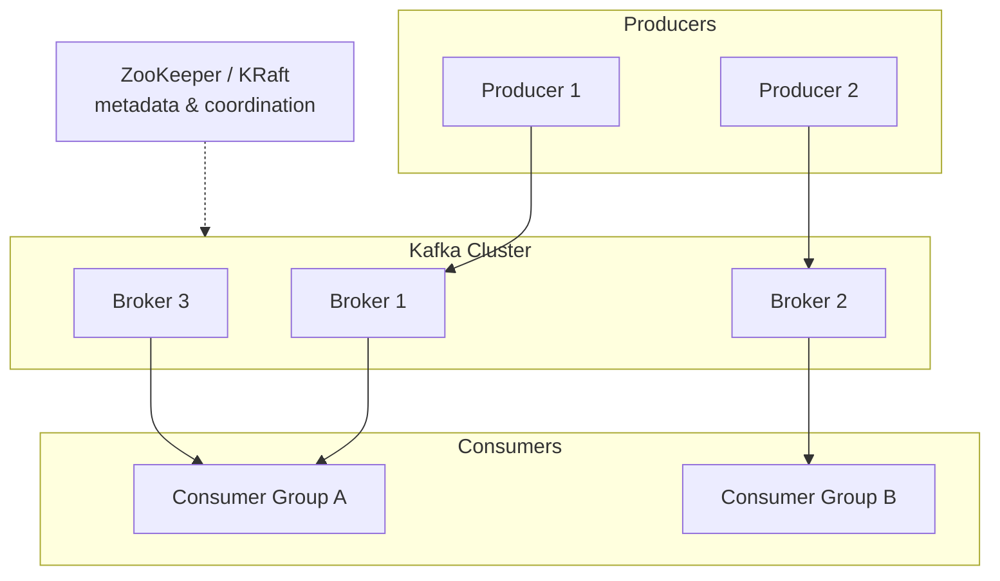
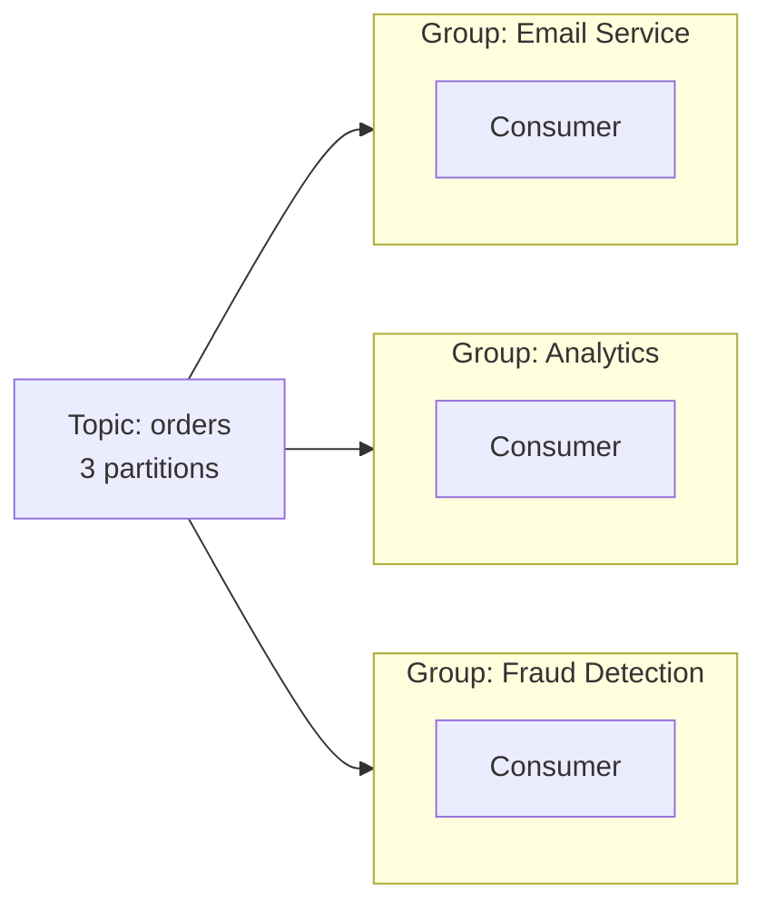
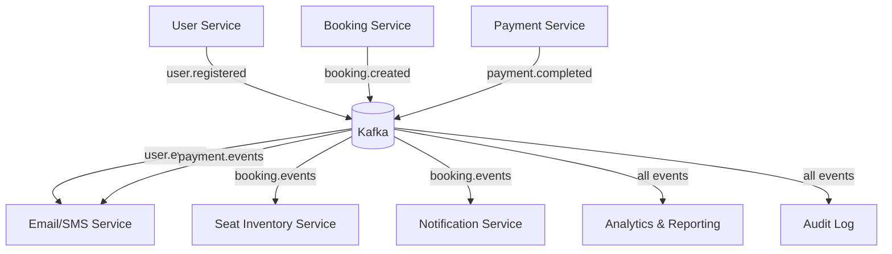

# Apache Kafka — Complete Guide (Beginner → Advanced)

This document explains Apache Kafka thoroughly — what it is, why it exists, its architecture, every core concept, and how it's used in real systems.

> Read [message-queues.md](message-queues.md) and [pub-sub.md](pub-sub.md) first. Kafka combines and extends both ideas.

---

## Table of Contents

1. [Prerequisite Concepts](#1-prerequisite-concepts)
2. [What is Kafka?](#2-what-is-kafka)
3. [The Log — Kafka's Core Idea](#3-the-log--kafkas-core-idea)
4. [Why Kafka Exists — The Problem It Solves](#4-why-kafka-exists--the-problem-it-solves)
5. [Core Architecture and Components](#5-core-architecture-and-components)
6. [Topics, Partitions, and Offsets](#6-topics-partitions-and-offsets)
7. [Producers — How Data Gets In](#7-producers--how-data-gets-in)
8. [Consumers and Consumer Groups](#8-consumers-and-consumer-groups)
9. [Replication and Fault Tolerance](#9-replication-and-fault-tolerance)
10. [Delivery Guarantees](#10-delivery-guarantees)
11. [Retention and Replay](#11-retention-and-replay)
12. [Kafka vs Other Systems](#12-kafka-vs-other-systems)
13. [Real Implementation Example](#13-real-implementation-example)
14. [Kafka in a Microservices System](#14-kafka-in-a-microservices-system)
15. [Interview Questions](#15-interview-questions)

---

## 1. Prerequisite Concepts

### Log (the data structure, not console logs)

An **append-only log** is a sequence of records where you can only add to the end, and each record gets a sequential number.

```
Position:  0      1      2      3      4
Records:  [A] →  [B] →  [C] →  [D] →  [E] →  (new records appended here)
```

You never modify or delete in the middle. You only append. This simple idea is the foundation of Kafka.

### Distributed system

Software running across multiple machines that work together and appear as one system. Kafka runs on a cluster of machines (brokers) for scale and fault tolerance.

### Horizontal scaling

Adding more machines to handle more load (vs vertical scaling = bigger machine). Kafka scales horizontally by adding brokers and partitions.

### Throughput

Volume of data processed per unit time. Kafka is built for **very high throughput** — millions of messages per second.

### Event / Record

A single piece of data in Kafka: a key, a value, a timestamp, and metadata. Represents something that happened ("user clicked", "payment made").

---

## 2. What is Kafka?

**Apache Kafka** is a **distributed event streaming platform**. In plain terms: a system for publishing, storing, and processing streams of events at massive scale, durably.

Originally built at LinkedIn (2011) to handle their enormous activity data, now used by most large tech companies.

### Three things Kafka does

1. **Publish & subscribe** to streams of events (like a message queue / pub-sub).
2. **Store** streams durably and reliably for as long as you want (like a database/log).
3. **Process** streams of events as they occur (with Kafka Streams / ksqlDB).

### What makes Kafka different

Unlike a traditional message queue that **deletes** a message once consumed, Kafka **stores** events in a durable log. Multiple consumers can read the same events, at different speeds, and you can **replay** old events anytime.

```
Traditional Queue:  message consumed → deleted → gone forever
Kafka:              event written → stored on disk → read many times → replayable
```

---

## 3. The Log — Kafka's Core Idea

Everything in Kafka is built on the **commit log**. A topic partition is literally an append-only log on disk.

```
Partition (a log):
  offset:   0     1     2     3     4     5     6
           [e0]  [e1]  [e2]  [e3]  [e4]  [e5]  [e6]  ← new events appended here →
                              ▲                 ▲
                       Consumer A          Consumer B
                       (reading offset 3)  (reading offset 6)
```

Key insights:

- Events are stored **in order** within a partition, each with a unique **offset** (its position).
- Consumers track **their own offset** — where they've read up to. They are independent.
- Consumer A can be slow (at offset 3) while Consumer B is caught up (at offset 6). They don't interfere.
- Events stay on disk based on a **retention policy** (e.g. 7 days), not based on whether they were consumed.

This is why Kafka is described as "a distributed, replayable, append-only log."

---

## 4. Why Kafka Exists — The Problem It Solves

### The N×M integration problem

Imagine you have many systems that produce data and many that consume it. Connecting each producer to each consumer directly creates a tangled mess:

```
Without Kafka (point-to-point chaos):

  Web App ──┬──→ Database
            ├──→ Analytics
            ├──→ Email
  Mobile ───┼──→ Database
            ├──→ Search Index
            └──→ Fraud Detection
  ...every source wired to every destination = N×M connections
```

### Kafka as the central nervous system

Kafka becomes a central hub. Producers write to Kafka; consumers read from Kafka. Everyone connects only to Kafka.



Now adding a new consumer doesn't touch any producer. This decoupling at scale is Kafka's superpower.

### When you specifically need Kafka

- Very high volume (millions of events/sec): clickstreams, logs, metrics, IoT
- Multiple independent consumers of the same data
- Need to replay history (reprocess events, recover from bugs, train ML models)
- Durable event storage, not just transient messaging
- Stream processing (real-time aggregations, joins)

---

## 5. Core Architecture and Components



### Components explained

| Component             | What it is                                                                                                  |
| --------------------- | ----------------------------------------------------------------------------------------------------------- |
| **Broker**            | A single Kafka server. It stores data and serves clients. A cluster has multiple brokers.                   |
| **Cluster**           | A group of brokers working together.                                                                        |
| **Producer**          | Client app that writes (publishes) events to topics.                                                        |
| **Consumer**          | Client app that reads (subscribes to) events from topics.                                                   |
| **Topic**             | A named category/stream of events (e.g. `orders`, `clicks`).                                                |
| **Partition**         | A topic is split into partitions — the unit of parallelism and ordering.                                    |
| **Offset**            | The sequential ID of an event within a partition.                                                           |
| **Consumer Group**    | A set of consumers that share the work of consuming a topic.                                                |
| **ZooKeeper / KRaft** | Manages cluster metadata, leader election. (Newer Kafka uses **KRaft**, removing the ZooKeeper dependency.) |

---

## 6. Topics, Partitions, and Offsets

This is the most important section to understand deeply.

### Topic

A logical channel/category of events. Producers write to a topic; consumers read from it.

```
Topic: "orders"
```

### Partition

Each topic is divided into one or more **partitions**. A partition is the actual append-only log on disk. Partitions enable:

1. **Parallelism** — different partitions can be processed by different consumers simultaneously.
2. **Scalability** — partitions can be spread across multiple brokers.
3. **Ordering** — order is guaranteed **within** a partition (but not across partitions).

```
Topic "orders" with 3 partitions:

Partition 0:  [o0] [o3] [o6] [o9]  →
Partition 1:  [o1] [o4] [o7]       →
Partition 2:  [o2] [o5] [o8]       →
```

### How events are assigned to partitions

- If the event has a **key**, Kafka hashes the key: `partition = hash(key) % numPartitions`. All events with the same key go to the **same partition** (preserving their order).
- If no key, events are distributed round-robin across partitions.

```
Example: key = userId
  All events for user "vinay" → always partition 1 → ordered for that user
  All events for user "alice" → always partition 2 → ordered for that user
```

This is how Kafka gives you ordering where it matters (per-key) while still allowing parallelism.

### Offset

Within each partition, every event has a monotonically increasing **offset** (0, 1, 2, ...). Consumers commit their offset to remember their position.

```
Partition 0:  offset 0    1    2    3    4
                   [a]  [b]  [c]  [d]  [e]
                                  ▲
                        Consumer committed offset 3
                        (next read starts at offset 4)
```

---

## 7. Producers — How Data Gets In

A producer sends events to a topic. Key producer concepts:

### Keys and partitioning

```js
producer.send({
  topic: 'orders',
  messages: [{key: 'user-42', value: JSON.stringify({orderId: 99, amount: 500})}]
});
// key "user-42" → hashed → always lands in the same partition
```

### Acknowledgement (acks) — durability vs speed

The producer can wait for different levels of confirmation:

| `acks` setting | Meaning                                | Trade-off              |
| -------------- | -------------------------------------- | ---------------------- |
| `acks=0`       | Don't wait for any confirmation        | Fastest, can lose data |
| `acks=1`       | Wait for the partition leader to write | Balanced               |
| `acks=all`     | Wait for leader + all in-sync replicas | Safest, slowest        |

### Batching and compression

Producers batch multiple events together and can compress them (gzip, snappy, lz4) for higher throughput and less network usage.

---

## 8. Consumers and Consumer Groups

This is where Kafka cleverly combines **queue** and **pub/sub** semantics.

### Consumer Group

A **consumer group** is a set of consumers that cooperate to consume a topic. Kafka assigns each partition to exactly **one** consumer within the group.

```
Topic "orders" (3 partitions), Consumer Group "order-processors" (3 consumers):

  Partition 0  →  Consumer 1
  Partition 1  →  Consumer 2
  Partition 2  →  Consumer 3

Work is split → like a message QUEUE (each event processed once per group)
```

If you add a 4th consumer, it sits idle (no partition to assign). If a consumer dies, its partitions are **rebalanced** to the others.

### Multiple consumer groups = Pub/Sub

Different consumer groups each receive **all** the events independently:



- Email Service group gets every order event.
- Analytics group gets every order event.
- Fraud group gets every order event.
- Each group independently tracks its own offsets.

**This is the key insight:**

```
Within a group  → queue behavior (work is divided, each event handled once)
Across groups   → pub/sub behavior (each group gets a full copy)
```

### Rebalancing

When consumers join or leave a group, Kafka **rebalances** — reassigns partitions among the available consumers. During rebalancing, consumption briefly pauses.

---

## 9. Replication and Fault Tolerance

Kafka stays available even when brokers crash, through **replication**.

### Leader and followers

Each partition has:

- One **leader** replica (handles all reads/writes)
- Several **follower** replicas (copy the leader's data)

```
Partition 0 (replication factor = 3):
  Broker 1: LEADER    [a][b][c]
  Broker 2: follower  [a][b][c]   ← copies from leader
  Broker 3: follower  [a][b][c]   ← copies from leader
```

### In-Sync Replicas (ISR)

Followers that are fully caught up with the leader are "in-sync" (the ISR set). If the leader broker dies, Kafka promotes an in-sync follower to be the new leader — no data loss, automatic failover.

```
Broker 1 (leader) CRASHES
  → Kafka elects Broker 2 (in-sync follower) as new leader
  → producers/consumers redirect to Broker 2
  → no data lost, system keeps running
```

### Replication factor

The number of copies of each partition. A factor of 3 means the data survives up to 2 broker failures. This is set per topic.

---

## 10. Delivery Guarantees

Kafka supports all three guarantee levels (see [message-queues.md](message-queues.md#7-delivery-guarantees) for the general concept).

| Guarantee         | How                                                                                                                                                      |
| ----------------- | -------------------------------------------------------------------------------------------------------------------------------------------------------- |
| **At-most-once**  | Consumer commits offset _before_ processing. If it crashes, the event is skipped.                                                                        |
| **At-least-once** | Consumer commits offset _after_ processing. If it crashes before committing, the event is reprocessed (duplicate possible). **Default and most common.** |
| **Exactly-once**  | Kafka's transactions + idempotent producer (EOS — Exactly Once Semantics). More overhead.                                                                |

For at-least-once (the norm), make your consumers **idempotent** to handle duplicates safely.

---

## 11. Retention and Replay

### Retention policy

Kafka keeps events for a configured time or size, regardless of consumption:

```
retention.ms = 604800000     → keep events for 7 days
retention.bytes = 1073741824 → keep up to 1GB per partition
```

After the retention period, old events are deleted.

### Log compaction (alternative retention)

Instead of deleting by time, Kafka can keep only the **latest** event for each key. Useful for "current state" topics (e.g. latest profile per user).

```
Before compaction:  key=u1:v1, key=u1:v2, key=u2:v1, key=u1:v3
After compaction:   key=u2:v1, key=u1:v3   (only latest per key kept)
```

### Replay — a superpower

Because events are stored, a consumer can **reset its offset** and reprocess from the beginning (or any point):

```
Use cases for replay:
  - A bug corrupted your database → fix code, replay events to rebuild
  - New analytics service → replay all history to backfill
  - Train an ML model on historical event data
  - Debug what actually happened by re-reading events
```

This is impossible with a traditional queue (where messages are deleted after consumption).

---

## 12. Kafka vs Other Systems

### Kafka vs RabbitMQ (Message Queue)

| Aspect                | Kafka                                  | RabbitMQ                          |
| --------------------- | -------------------------------------- | --------------------------------- |
| Model                 | Distributed log                        | Traditional broker with queues    |
| Message after consume | Retained (replayable)                  | Deleted                           |
| Throughput            | Very high (millions/sec)               | High (tens of thousands/sec)      |
| Routing               | Simple (topic + partition)             | Rich (exchanges, routing keys)    |
| Ordering              | Per-partition                          | Per-queue                         |
| Best for              | Event streaming, analytics, high scale | Complex routing, task queues, RPC |

### Kafka vs Redis Pub/Sub

| Aspect           | Kafka                      | Redis Pub/Sub                  |
| ---------------- | -------------------------- | ------------------------------ |
| Durability       | ✅ Persistent on disk      | ❌ Ephemeral                   |
| Replay           | ✅ Yes                     | ❌ No                          |
| Scale            | Massive                    | Moderate                       |
| Latency          | Low (ms)                   | Very low (sub-ms)              |
| Setup complexity | Higher                     | Very simple                    |
| Best for         | Durable streaming at scale | Simple real-time notifications |

### Summary decision guide

```
Need durable, replayable, high-scale event streaming?     → Kafka
Need complex routing and reliable task queues?            → RabbitMQ
Need simple, ultra-low-latency live notifications?        → Redis Pub/Sub
Need lightweight job queue with Redis you already have?   → BullMQ / Redis Streams
```

---

## 13. Real Implementation Example

Using **KafkaJS** (the popular Node.js Kafka client).

### Setup

```js
// config/kafka.js
const {Kafka} = require('kafkajs');

const kafka = new Kafka({
  clientId: 'user-service',
  brokers: ['localhost:9092'] // your Kafka broker addresses
});

module.exports = {kafka};
```

### Producer (publish an event after registration)

```js
// In auth.service.js — after creating the user
const {kafka} = require('../config/kafka');
const producer = kafka.producer();
await producer.connect();

await producer.send({
  topic: 'user.events',
  messages: [
    {
      key: user.id, // same user → same partition → ordered
      value: JSON.stringify({
        type: 'user.registered',
        userId: user.id,
        email: user.email,
        timestamp: Date.now()
      })
    }
  ]
});
// API responds immediately; downstream services react asynchronously
```

### Consumer (email service in a separate process)

```js
// services/emailConsumer.js
const {kafka} = require('../config/kafka');

const consumer = kafka.consumer({groupId: 'email-service'});

async function run() {
  await consumer.connect();
  await consumer.subscribe({topic: 'user.events', fromBeginning: false});

  await consumer.run({
    eachMessage: async ({topic, partition, message}) => {
      const event = JSON.parse(message.value.toString());

      if (event.type === 'user.registered') {
        await sendWelcomeEmail(event.email);
        console.log(`Welcome email sent to ${event.email}`);
      }
      // Offset is auto-committed after successful processing (at-least-once)
    }
  });
}

run().catch(console.error);
```

### Multiple consumer groups

```js
// Analytics service — DIFFERENT groupId → gets its own copy of every event
const analyticsConsumer = kafka.consumer({groupId: 'analytics-service'});
// ... subscribes to the same "user.events" topic
// Both email-service and analytics-service receive every event independently
```

---

## 14. Kafka in a Microservices System

Here is how Kafka would fit into a full IRCTC-style booking platform:



### Example flow: booking a train ticket

```
1. User Service publishes "user.registered" when account created
2. Booking Service publishes "booking.created" when a ticket is booked
3. Inventory Service consumes "booking.created" → decrements available seats
4. Payment Service publishes "payment.completed" after payment
5. Email Service consumes both booking + payment events → sends confirmation
6. Analytics consumes everything → builds dashboards
7. Audit Service consumes everything → compliance log (replayable)

Each service is decoupled. Adding a new service (e.g. loyalty points)
just means subscribing to existing topics — no other service changes.
```

### Benefits in this architecture

- **Decoupling**: services don't call each other directly
- **Resilience**: if Email Service is down, events wait in Kafka and are processed when it recovers
- **Scalability**: each service scales its consumers independently
- **Auditability**: every event is stored and replayable
- **Flexibility**: new consumers added without touching producers

---

## 15. Interview Questions

**Q: What is Kafka?**
A distributed event streaming platform that publishes, durably stores, and processes streams of events at high scale, based on an append-only commit log.

**Q: How is Kafka different from a traditional message queue?**
Kafka stores events durably and allows replay; traditional queues delete messages after consumption. Kafka also scales to far higher throughput.

**Q: Explain topics, partitions, and offsets.**
A topic is a named event stream. It's split into partitions (append-only logs) for parallelism and scaling. Each event in a partition has a sequential offset marking its position.

**Q: How does Kafka guarantee ordering?**
Order is guaranteed only within a partition. To order related events, give them the same key so they hash to the same partition.

**Q: What is a consumer group?**
A set of consumers sharing a topic's work. Each partition goes to one consumer in the group (queue behavior). Different groups each get all events (pub/sub behavior).

**Q: How does Kafka combine queue and pub/sub semantics?**
Within a consumer group → work is split (queue). Across consumer groups → each gets a full copy (pub/sub).

**Q: What happens when a consumer in a group dies?**
Kafka rebalances — its partitions are reassigned to the remaining consumers in the group.

**Q: How does Kafka achieve fault tolerance?**
Partition replication. Each partition has a leader and follower replicas across brokers. If the leader fails, an in-sync replica is promoted.

**Q: What are the delivery guarantees?**
At-most-once, at-least-once (default), exactly-once (via transactions/idempotent producer). At-least-once needs idempotent consumers.

**Q: What is offset commit?**
A consumer recording how far it has read in a partition, so it can resume from there after a restart.

**Q: What is log compaction?**
A retention mode that keeps only the latest event per key, useful for representing current state.

**Q: Why can Kafka replay events?**
Events are stored on disk per a retention policy, independent of consumption. A consumer can reset its offset to reprocess old events.

**Q: What replaced ZooKeeper in newer Kafka?**
KRaft (Kafka Raft) mode — Kafka manages its own metadata and consensus, removing the external ZooKeeper dependency.

**Q: When would you NOT use Kafka?**
For simple low-volume apps, basic task queues, request/response, or ultra-low-latency fire-and-forget — Kafka's operational complexity isn't justified. Use RabbitMQ, Redis, or direct calls instead.
