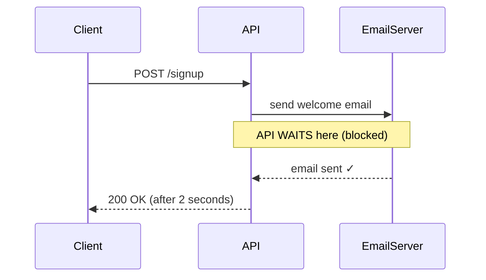
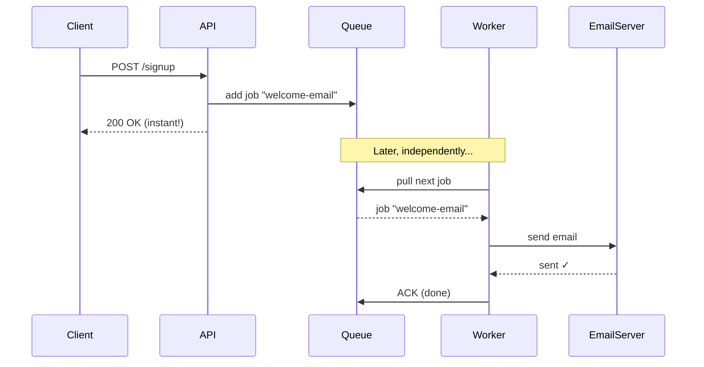
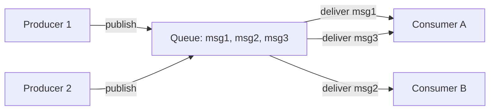
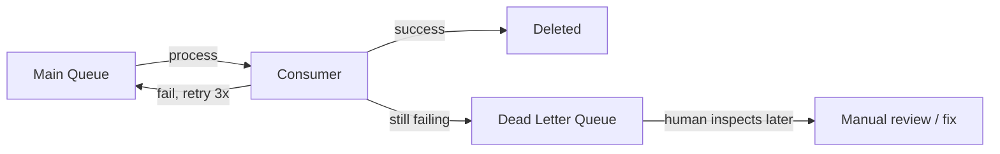
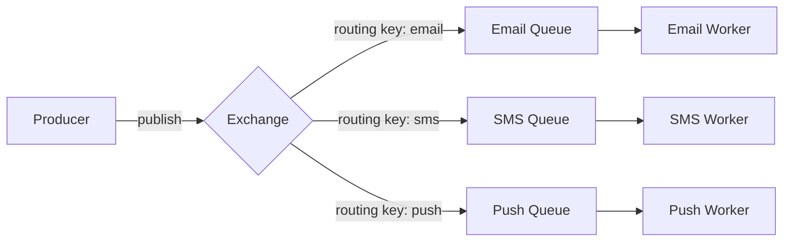

# Message Queues — Complete Guide (Beginner → Advanced)

This document explains message queues from the ground up. No prior knowledge assumed.

---

## Table of Contents

1. [Prerequisite Concepts](#1-prerequisite-concepts)
2. [The Problem — Why Message Queues Exist](#2-the-problem--why-message-queues-exist)
3. [What is a Message Queue?](#3-what-is-a-message-queue)
4. [Core Terminology](#4-core-terminology)
5. [Synchronous vs Asynchronous](#5-synchronous-vs-asynchronous)
6. [How a Message Queue Works — Step by Step](#6-how-a-message-queue-works--step-by-step)
7. [Delivery Guarantees](#7-delivery-guarantees)
8. [Acknowledgements, Retries, Dead Letter Queues](#8-acknowledgements-retries-dead-letter-queues)
9. [Popular Message Queue Systems](#9-popular-message-queue-systems)
10. [Real Implementation Example](#10-real-implementation-example)
11. [When to Use / When Not to Use](#11-when-to-use--when-not-to-use)
12. [Interview Questions](#12-interview-questions)

---

## 1. Prerequisite Concepts

Before message queues, you need to understand these basic ideas.

### Process

A program that is running. Your backend server is a process. A separate worker script is another process.

### Blocking vs Non-blocking

- **Blocking:** Your code stops and waits for an operation to finish before continuing.
- **Non-blocking:** Your code starts an operation and continues immediately, handling the result later.

```
Blocking:
  sendEmail()      ← waits 3 seconds for email server
  return response  ← user waited 3 seconds

Non-blocking:
  queue.add(emailJob)  ← takes 5 milliseconds
  return response      ← user gets instant response
  (email sent later by a worker)
```

### Producer and Consumer

- **Producer:** Code that creates work and puts it somewhere.
- **Consumer:** Code that takes the work and does it.

### Decoupling

Two systems are **decoupled** when they do not directly depend on each other. They can change, restart, or fail independently. Message queues are a tool for decoupling.

### Throughput and Latency

- **Throughput:** How many operations per second (e.g. 10,000 messages/sec).
- **Latency:** How long one operation takes (e.g. 5 ms per message).

---

## 2. The Problem — Why Message Queues Exist

Imagine a user signs up. After signup, your system must:

1. Save the user to the database
2. Send a welcome email
3. Generate a profile thumbnail
4. Notify the analytics system
5. Add the user to a marketing list

### The naive (synchronous) approach

```
POST /signup
  ├─ save user to DB        (50ms)
  ├─ send welcome email     (2000ms ← slow email server)
  ├─ generate thumbnail     (1500ms ← CPU heavy)
  ├─ notify analytics       (800ms ← external API)
  └─ add to marketing list  (600ms ← external API)
  └─ return response

Total: ~4950ms = the user waited 5 SECONDS for the signup button
```

### Problems with this approach

1. **Slow** — the user waits for everything, even unrelated tasks.
2. **Fragile** — if the email server is down, the whole signup fails.
3. **Not scalable** — under heavy load, slow tasks pile up and crash the server.
4. **Tightly coupled** — signup logic knows about email, analytics, thumbnails, marketing.

### The message queue solution

```
POST /signup
  ├─ save user to DB              (50ms)
  ├─ queue.add("welcome-email")   (3ms)
  ├─ queue.add("generate-thumb")  (3ms)
  ├─ queue.add("notify-analytics")(3ms)
  ├─ queue.add("marketing-list")  (3ms)
  └─ return response

Total: ~62ms = instant response!

Meanwhile, separate worker processes pick up the jobs from the queue
and do the slow work in the background.
```

---

## 3. What is a Message Queue?

A **message queue** is a component that stores messages (tasks/jobs) in order, so that producers can add messages and consumers can take them out and process them — at their own pace.

Think of it as a **to-do list** shared between systems:

- Producers write tasks onto the list.
- Consumers (workers) pick tasks off the list and do them.
- The list acts as a buffer between the two.

### The restaurant analogy

```
Customers (Producers)  →  Order tickets pinned up  →  Cooks (Consumers)
                          (the Message Queue)

- Customers place orders quickly and sit down (don't wait at the counter)
- Order tickets queue up in order
- Cooks take one ticket at a time and cook
- If 100 orders come at once, tickets just queue up — nothing is lost
- Add more cooks (consumers) to process faster
```

---

## 4. Core Terminology

| Term                        | Meaning                                                                       |
| --------------------------- | ----------------------------------------------------------------------------- |
| **Message**                 | A single unit of data/task (e.g. "send email to X")                           |
| **Queue**                   | The ordered buffer that holds messages                                        |
| **Producer**                | Sends messages into the queue (also called Publisher)                         |
| **Consumer**                | Reads and processes messages from the queue (also called Worker/Subscriber)   |
| **Broker**                  | The server that manages the queue (RabbitMQ, etc.)                            |
| **Acknowledgement (ACK)**   | A signal from consumer saying "I successfully processed this message"         |
| **NACK**                    | "I failed to process this message" — may trigger a retry                      |
| **Dead Letter Queue (DLQ)** | A separate queue for messages that repeatedly failed                          |
| **FIFO**                    | First In, First Out — messages processed in the order they arrived            |
| **Visibility timeout**      | Time a message is hidden from other consumers while one consumer processes it |
| **Prefetch**                | How many messages a consumer grabs at once                                    |

---

## 5. Synchronous vs Asynchronous

This is the central idea behind message queues.

### Synchronous (request/response)

The caller waits for the result.



### Asynchronous (fire and forget via queue)

The caller does not wait. The work happens later.



---

## 6. How a Message Queue Works — Step by Step



### The lifecycle of one message

```
1. Producer creates a message:
   { type: "send-email", to: "vinay@example.com", template: "welcome" }

2. Producer publishes it to the queue (broker stores it)

3. Message waits in the queue (could be ms or hours)

4. A consumer becomes available and pulls the message

5. The message is marked "in-flight" (hidden from other consumers)
   so two workers don't process the same message

6. Consumer processes the message (sends the email)

7a. SUCCESS → consumer sends ACK → broker deletes the message
7b. FAILURE → consumer sends NACK (or times out) → broker
    makes the message visible again for retry
```

### Key property: one message → one consumer

In a **work queue**, each message is delivered to exactly **one** consumer. If you have 3 workers and 30 messages, each worker handles ~10 messages. This is called **competing consumers** and it's how you scale processing horizontally.

> This is the main difference from Pub/Sub (see [pub-sub.md](pub-sub.md)), where each message goes to **all** subscribers.

---

## 7. Delivery Guarantees

When a message is sent, how sure are we it gets processed? There are three levels.

### At-most-once

The message is delivered zero or one times. It may be lost, but never duplicated.

```
Use when: losing a message is acceptable (e.g. non-critical metrics)
Risk: data loss
```

### At-least-once (most common)

The message is delivered one or more times. It is never lost, but may be processed twice.

```
Use when: you cannot lose messages (e.g. orders, payments)
Risk: duplicate processing → requires idempotency (see below)
```

### Exactly-once

The message is processed exactly one time. Hardest to achieve, has performance cost.

```
Use when: duplicates are unacceptable AND loss is unacceptable
Cost: extra coordination, slower
```

### Idempotency — the key to handling duplicates

An operation is **idempotent** if doing it twice has the same effect as doing it once.

```
NOT idempotent:  balance = balance + 100   (run twice → +200, wrong!)
Idempotent:      balance = 500             (run twice → still 500, correct)

Practical pattern: attach a unique ID to each message.
Before processing, check "have I seen this ID?" If yes, skip.

processed_ids = Redis SET
if message.id in processed_ids: skip
else: process + add message.id to processed_ids
```

---

## 8. Acknowledgements, Retries, Dead Letter Queues

### Acknowledgement (ACK)

After a consumer successfully processes a message, it sends an ACK. Only then does the broker delete the message.

If the consumer crashes **before** sending the ACK, the broker assumes failure and re-delivers the message to another consumer. This guarantees the message is not lost.

```
Consumer pulls message
  → starts processing
  → CRASH (no ACK sent)
  → broker waits for visibility timeout
  → broker re-delivers to another consumer
```

### Retries

When processing fails, the broker can retry the message a configurable number of times, often with **exponential backoff**:

```
Attempt 1: immediately
Attempt 2: wait 1 second
Attempt 3: wait 4 seconds
Attempt 4: wait 16 seconds
...
```

### Dead Letter Queue (DLQ)

If a message fails after all retries, it is moved to a **Dead Letter Queue** — a separate queue for "poison" messages. This prevents one bad message from blocking the whole queue.



Engineers monitor the DLQ to find bugs, bad data, or external service problems.

---

## 9. Popular Message Queue Systems

| System                      | Type                     | Best for                         | Notes                                            |
| --------------------------- | ------------------------ | -------------------------------- | ------------------------------------------------ |
| **RabbitMQ**                | Traditional broker       | General purpose, complex routing | Mature, AMQP protocol, flexible                  |
| **Amazon SQS**              | Managed cloud queue      | AWS apps, simple setup           | Fully managed, scales automatically              |
| **Redis (Lists / Streams)** | In-memory                | Lightweight jobs, low latency    | Fast but less durable than dedicated brokers     |
| **BullMQ**                  | Node.js library on Redis | Node.js job queues               | Popular in Node ecosystem                        |
| **Apache Kafka**            | Event streaming log      | High throughput, event replay    | Technically different (see [kafka.md](kafka.md)) |
| **Google Pub/Sub**          | Managed cloud            | GCP apps                         | Combines queue + pub/sub semantics               |

### RabbitMQ core architecture

RabbitMQ adds a layer called an **Exchange** between producers and queues. The exchange decides which queue(s) a message goes to based on **routing rules**.



Exchange types: `direct` (exact match), `topic` (pattern match), `fanout` (broadcast to all), `headers` (match on headers).

---

## 10. Real Implementation Example

Here is how you would add a job queue to this project using **BullMQ** (Redis-backed).

### Producer (in the API, after signup)

```js
// queue/emailQueue.js
const {Queue} = require('bullmq');
const {getRedisClient} = require('../config/redis');

const emailQueue = new Queue('email', {
  connection: getRedisClient()
});

module.exports = {emailQueue};
```

```js
// In auth.service.js — after creating the user
const {emailQueue} = require('../queue/emailQueue');

await emailQueue.add(
  'welcome-email',
  {
    to: user.email,
    firstName: user.firstName
  },
  {
    attempts: 3, // retry 3 times on failure
    backoff: {type: 'exponential', delay: 1000}
  }
);

// API returns immediately — email is sent later by the worker
```

### Consumer (a separate worker process)

```js
// workers/emailWorker.js
const {Worker} = require('bullmq');
const {getRedisClient} = require('../config/redis');
const {sendEmail} = require('../utils/email');

const worker = new Worker(
  'email',
  async (job) => {
    if (job.name === 'welcome-email') {
      await sendEmail({
        to: job.data.to,
        subject: 'Welcome!',
        body: `Hello ${job.data.firstName}, welcome aboard!`
      });
    }
  },
  {
    connection: getRedisClient(),
    concurrency: 5 // process 5 jobs in parallel
  }
);

worker.on('completed', (job) => console.log(`Job ${job.id} done`));
worker.on('failed', (job, err) => console.error(`Job ${job.id} failed:`, err));
```

You run the worker as a separate process:

```bash
node workers/emailWorker.js
```

Now your API stays fast, and email sending happens independently. If the email server is down, jobs retry automatically without affecting signups.

---

## 11. When to Use / When Not to Use

### Use a message queue when

- A task is slow and the user doesn't need to wait for it (emails, PDFs, image processing)
- You need to smooth out traffic spikes (buffer requests, process steadily)
- You want to decouple services (service A doesn't need to know about service B)
- You need retry logic for unreliable external services
- You want to scale workers independently from the API

### Do NOT use a message queue when

- The caller genuinely needs the result immediately (use synchronous request/response)
- The task is trivially fast (queuing overhead is not worth it)
- You need strict real-time ordering with a single processor (a queue with one consumer adds complexity)
- Your app is tiny and adding infrastructure is overkill

---

## 12. Interview Questions

**Q: What is a message queue and why use one?**
A buffer that holds tasks between producers and consumers, enabling asynchronous processing, decoupling, load smoothing, and reliable retries.

**Q: Difference between a message queue and pub/sub?**
In a queue, each message goes to exactly **one** consumer (competing consumers). In pub/sub, each message is broadcast to **all** subscribers. See [pub-sub.md](pub-sub.md).

**Q: What are delivery guarantees?**
At-most-once (may lose), at-least-once (may duplicate), exactly-once (hardest). Most systems use at-least-once + idempotent consumers.

**Q: What is idempotency and why does it matter?**
An operation that produces the same result whether run once or many times. It is essential because at-least-once delivery can deliver duplicates.

**Q: What is a Dead Letter Queue?**
A separate queue for messages that failed processing after all retries, so they don't block the main queue and can be inspected later.

**Q: What happens if a consumer crashes mid-processing?**
The broker never received an ACK, so after the visibility timeout it re-delivers the message to another consumer. This is why at-least-once delivery can cause duplicates.

**Q: How do you scale message processing?**
Add more consumers (competing consumers pattern). The broker distributes messages across them.

**Q: What is backpressure?**
When producers send faster than consumers can process. The queue grows. Solutions: add consumers, rate-limit producers, or set max queue size.

**Q: ACK vs NACK?**
ACK = successfully processed, delete the message. NACK = failed, requeue or send to DLQ.
