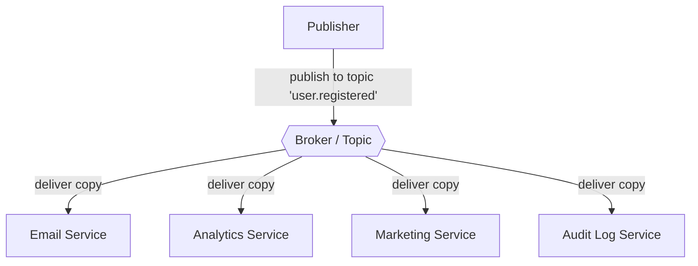
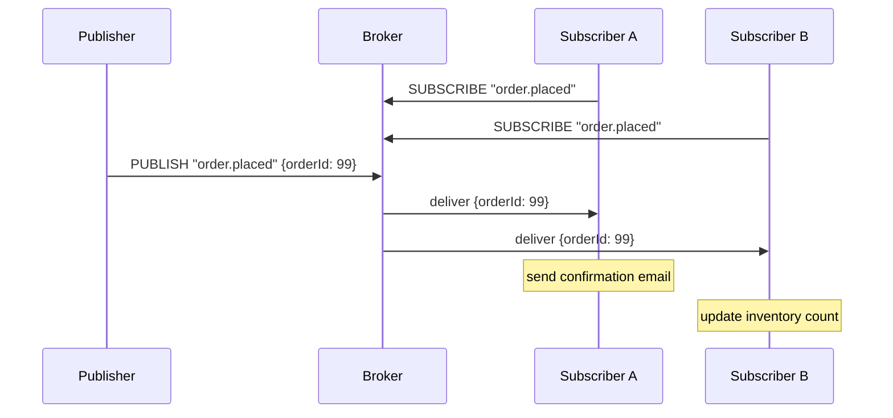
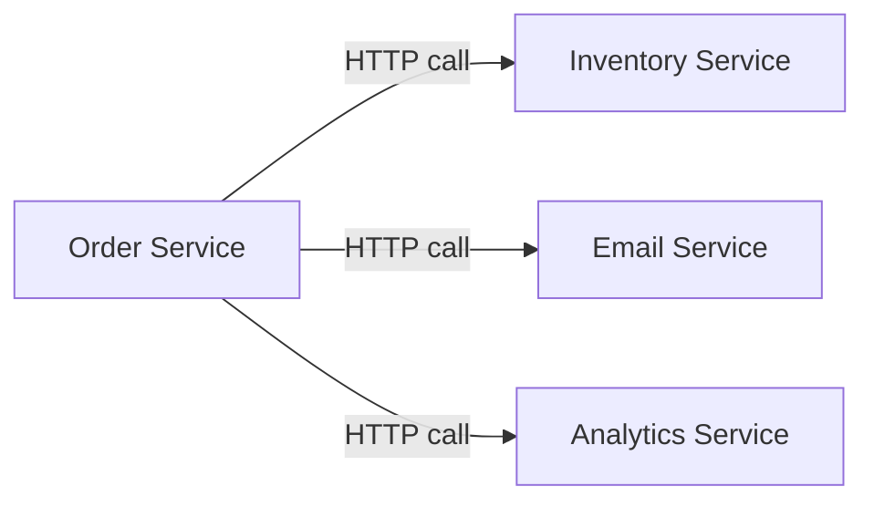
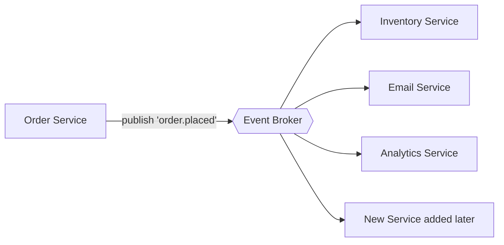

# Publish/Subscribe (Pub/Sub) — Complete Guide (Beginner → Advanced)

This document explains the Publish/Subscribe messaging pattern in full detail.

> Read [message-queues.md](message-queues.md) first — Pub/Sub builds on the same async messaging ideas.

---

## Table of Contents

1. [Prerequisite Concepts](#1-prerequisite-concepts)
2. [What is Pub/Sub?](#2-what-is-pubsub)
3. [The Core Idea — Broadcasting](#3-the-core-idea--broadcasting)
4. [Pub/Sub vs Message Queue](#4-pubsub-vs-message-queue)
5. [Core Terminology](#5-core-terminology)
6. [How Pub/Sub Works — Step by Step](#6-how-pubsub-works--step-by-step)
7. [Topics, Channels, and Filtering](#7-topics-channels-and-filtering)
8. [Push vs Pull Delivery](#8-push-vs-pull-delivery)
9. [Event-Driven Architecture](#9-event-driven-architecture)
10. [Pub/Sub Systems Compared](#10-pubsub-systems-compared)
11. [Real Implementation Example (Redis Pub/Sub)](#11-real-implementation-example-redis-pubsub)
12. [Strengths, Weaknesses, When to Use](#12-strengths-weaknesses-when-to-use)
13. [Interview Questions](#13-interview-questions)

---

## 1. Prerequisite Concepts

### Event

Something that happened in the system, represented as a message.

```
"user.registered"   → a user signed up
"order.placed"      → an order was created
"payment.completed" → a payment succeeded
```

### Loose coupling

The publisher and subscribers do not know about each other. The publisher just announces "this happened" and doesn't care who listens or how many.

### Broadcast vs unicast

- **Unicast:** one sender → one receiver (like a phone call). Message queues do this.
- **Broadcast:** one sender → many receivers (like a radio station). Pub/Sub does this.

### Fan-out

One incoming message produces multiple outgoing deliveries (one per subscriber). The "fan" shape: 1 → many.

---

## 2. What is Pub/Sub?

**Publish/Subscribe** is a messaging pattern where:

- **Publishers** send messages to a named **topic** (not to specific receivers).
- **Subscribers** express interest in a topic and receive **every** message published to it.
- A **broker** sits in the middle and delivers each message to all current subscribers.

The crucial property: **the publisher has no knowledge of the subscribers.** It could be 0 subscribers, 1, or 1,000 — the publisher's code is identical.

### The radio analogy

```
Radio Station (Publisher)
       │
       │ broadcasts on 98.3 FM (Topic)
       ▼
   ┌───────┬───────┬───────┐
   ▼       ▼       ▼       ▼
 Car 1   Car 2   Home   Phone     ← Subscribers
 radio   radio   radio  radio

- The station doesn't know who is listening
- Anyone tuned to 98.3 FM hears the broadcast
- Listeners can tune in or out anytime
- A listener who tunes in late misses earlier broadcasts (ephemeral)
```

---

## 3. The Core Idea — Broadcasting



When a user registers, ONE event is published. FOUR different services each receive their own copy and react independently:

- Email Service → sends a welcome email
- Analytics Service → increments the signup counter
- Marketing Service → adds the user to a campaign
- Audit Service → records the event for compliance

The signup code does not import or call any of these. It just publishes `user.registered`. New services can subscribe later **without changing the publisher**. This is the power of Pub/Sub.

---

## 4. Pub/Sub vs Message Queue

This is the single most important distinction. Interviewers love this question.

```
MESSAGE QUEUE (competing consumers)        PUB/SUB (broadcast)

   Producer                                   Publisher
      │                                           │
      ▼                                           ▼
  ┌────────┐                                  ┌────────┐
  │ Queue  │                                  │ Topic  │
  └────────┘                                  └────────┘
   │   │   │                                   │   │   │
   ▼   ▼   ▼                                   ▼   ▼   ▼
  C1  C2  C3                                  S1  S2  S3

 ONE message → ONE consumer                ONE message → ALL subscribers
 (work is split among consumers)           (every subscriber gets a copy)
```

| Aspect                 | Message Queue                             | Pub/Sub                                    |
| ---------------------- | ----------------------------------------- | ------------------------------------------ |
| Delivery               | One message → one consumer                | One message → all subscribers              |
| Purpose                | Distribute work / load balance            | Broadcast events / notify many             |
| Consumers relationship | Competing (share the load)                | Independent (each gets everything)         |
| Adding a consumer      | Helps process faster                      | Adds another full copy receiver            |
| Example use            | Process 1000 image jobs across 10 workers | Notify 5 services that an order was placed |

### A key real-world combination

Most large systems combine both: a topic fans out to multiple **consumer groups**, and within each group, work is queued/load-balanced. Kafka does exactly this (see [kafka.md](kafka.md)).

---

## 5. Core Terminology

| Term                     | Meaning                                                              |
| ------------------------ | -------------------------------------------------------------------- |
| **Publisher**            | Sends messages to a topic (also called Producer)                     |
| **Subscriber**           | Receives messages from a topic (also called Consumer)                |
| **Topic**                | A named channel messages are published to (e.g. `order.placed`)      |
| **Channel**              | Same as topic in many systems (Redis calls them channels)            |
| **Broker**               | The middleware that routes messages from publishers to subscribers   |
| **Subscription**         | A subscriber's registered interest in a topic                        |
| **Fan-out**              | Delivering one message to many subscribers                           |
| **Event**                | The message content describing what happened                         |
| **Ephemeral**            | Messages exist only momentarily; subscribers not connected miss them |
| **Durable subscription** | The broker stores messages for a subscriber even when offline        |

---

## 6. How Pub/Sub Works — Step by Step



### Lifecycle

```
1. Subscribers register interest:  SUBSCRIBE "order.placed"
2. Broker keeps a list: order.placed → [SubA, SubB]
3. Publisher publishes:  PUBLISH "order.placed" {data}
4. Broker looks up subscribers for that topic
5. Broker sends a copy to EACH subscriber
6. Each subscriber processes independently
```

### Important: timing matters in basic pub/sub

In **basic** pub/sub (like Redis Pub/Sub), messages are **ephemeral** (fire-and-forget):

- If a subscriber is offline when a message is published, it **misses** the message forever.
- There is no storage, no replay, no history.

This is fine for live notifications (chat, live scores) but bad for critical events (payments). For durability, you need **durable subscriptions** or a **log-based system** like Kafka.

---

## 7. Topics, Channels, and Filtering

### Topic naming conventions

Topics are usually named hierarchically with dots:

```
user.registered
user.deleted
order.placed
order.cancelled
payment.completed
payment.failed
```

### Pattern subscriptions (wildcards)

Many systems let you subscribe to patterns:

```
order.*        → matches order.placed, order.cancelled, order.shipped
user.*         → matches all user events
*.failed       → matches payment.failed, order.failed (in some systems)
```

Redis uses `PSUBSCRIBE` for pattern subscriptions:

```
PSUBSCRIBE order.*     → receive all order events
```

### Content-based filtering

Some advanced systems (like Google Pub/Sub, AWS SNS) let subscribers filter by message attributes:

```
Subscribe to "order.placed" WHERE amount > 1000
```

---

## 8. Push vs Pull Delivery

How does a subscriber actually receive messages?

### Push model

The broker actively sends (pushes) messages to subscribers as they arrive.

```
Broker → "here's a message!" → Subscriber
```

- Low latency (instant delivery)
- Subscriber must be online and able to keep up
- Used by: Redis Pub/Sub, WebSockets, webhooks

### Pull model

Subscribers ask (poll) the broker for new messages.

```
Subscriber → "any new messages?" → Broker → "here are 10"
```

- Subscriber controls its own pace (good for backpressure)
- Slightly higher latency
- Used by: Kafka, SQS, Google Pub/Sub (pull mode)

---

## 9. Event-Driven Architecture

Pub/Sub is the foundation of **event-driven architecture (EDA)** — a design where services communicate by emitting and reacting to events instead of calling each other directly.

### Request-driven (traditional)



Problem: Order Service must know about and call every other service. If Email Service is down, the order might fail. Adding a new service means changing Order Service.

### Event-driven (pub/sub)



Benefits:

- Order Service only publishes one event; it knows nothing about consumers.
- Services can be added/removed without touching the publisher.
- If Email Service is down, the order still succeeds; email is handled when it recovers (with durable pub/sub).
- Each service scales independently.

### Trade-offs of event-driven systems

- Harder to debug (flow is spread across services, not a single call stack)
- Eventual consistency (things happen asynchronously, not instantly)
- Requires good monitoring and tracing
- Message ordering and duplicates must be handled

---

## 10. Pub/Sub Systems Compared

| System                | Durability          | Replay  | Best for                                |
| --------------------- | ------------------- | ------- | --------------------------------------- |
| **Redis Pub/Sub**     | ❌ Ephemeral        | ❌ No   | Live notifications, low latency, simple |
| **Redis Streams**     | ✅ Persistent       | ✅ Yes  | Lightweight durable streams             |
| **Apache Kafka**      | ✅ Persistent (log) | ✅ Yes  | High-scale event streaming, replay      |
| **Google Pub/Sub**    | ✅ Persistent       | Limited | Managed cloud, GCP                      |
| **AWS SNS**           | ✅ (with SQS)       | ❌      | Cloud fan-out, mobile push              |
| **RabbitMQ (fanout)** | ✅ Optional         | ❌      | Traditional broker with broadcast       |
| **MQTT**              | Optional            | ❌      | IoT devices, lightweight                |

---

## 11. Real Implementation Example (Redis Pub/Sub)

Redis has built-in Pub/Sub. Here's how you'd use it in this project for real-time notifications.

> Important: Redis Pub/Sub requires a **separate connection** for subscribing, because a subscriber connection cannot run normal commands.

### Publisher (in the API)

```js
// In auth.service.js — after a user logs in
const {getRedisClient} = require('../config/redis');

const redis = getRedisClient();

// Publish a login event
await redis.publish(
  'user.activity',
  JSON.stringify({
    type: 'login',
    userId: existingUser.id,
    timestamp: Date.now()
  })
);
```

### Subscriber (a separate service)

```js
// services/activityMonitor.js
const Redis = require('ioredis');

// Dedicated connection just for subscribing
const subscriber = new Redis(process.env.REDIS_URL);

subscriber.subscribe('user.activity', (err, count) => {
  if (err) return console.error('Subscribe failed', err);
  console.log(`Subscribed to ${count} channel(s)`);
});

subscriber.on('message', (channel, message) => {
  const event = JSON.parse(message);
  console.log(`[${channel}] User ${event.userId} did: ${event.type}`);
  // e.g. update a live dashboard, detect suspicious logins, etc.
});
```

### Pattern subscription example

```js
// Subscribe to ALL user events: user.login, user.logout, user.registered
subscriber.psubscribe('user.*');

subscriber.on('pmessage', (pattern, channel, message) => {
  console.log(`Pattern ${pattern} matched channel ${channel}`);
  console.log('Message:', JSON.parse(message));
});
```

### What happens

```
1. activityMonitor.js subscribes to "user.activity"
2. A user logs in → API publishes "user.activity" event
3. Redis instantly pushes the message to activityMonitor
4. Monitor reacts (dashboard update, fraud check, etc.)
5. If monitor is OFFLINE when the event fires → it misses it (ephemeral!)
```

---

## 12. Strengths, Weaknesses, When to Use

### Strengths

- Decouples publishers from subscribers completely
- Easy to add new subscribers without changing publishers
- Natural fit for broadcasting and notifications
- Enables event-driven architecture and microservices

### Weaknesses

- Basic pub/sub is ephemeral (offline subscribers miss messages)
- Harder to debug and trace
- No built-in guarantee of processing (unless durable)
- Ordering and duplicates need careful handling

### Use Pub/Sub when

- Multiple services need to react to the same event
- You want real-time notifications (chat, live scores, dashboards)
- You're building event-driven microservices
- The publisher shouldn't know or care who consumes

### Use a Message Queue instead when

- You need work distributed among workers (one task, one worker)
- You need guaranteed processing with retries and DLQ
- See [message-queues.md](message-queues.md)

---

## 13. Interview Questions

**Q: What is Pub/Sub?**
A messaging pattern where publishers send messages to topics and all subscribers of that topic receive a copy. Publishers don't know who subscribes.

**Q: Pub/Sub vs Message Queue — the key difference?**
Queue: one message → one consumer (work splitting). Pub/Sub: one message → all subscribers (broadcast).

**Q: What does "ephemeral" mean in Redis Pub/Sub?**
Messages are not stored. If a subscriber is offline when a message is published, it misses it permanently. No replay.

**Q: What is fan-out?**
One published message being delivered to many subscribers simultaneously.

**Q: Push vs pull delivery?**
Push: broker sends messages to subscribers immediately (low latency). Pull: subscribers poll for messages (better backpressure control).

**Q: What is event-driven architecture?**
A design where services communicate by emitting and reacting to events via a broker, instead of directly calling each other. Enables loose coupling.

**Q: How do you make pub/sub durable?**
Use a log-based system (Kafka, Redis Streams) that persists messages, allowing offline subscribers to catch up and messages to be replayed.

**Q: When would you choose Kafka over Redis Pub/Sub?**
When you need durability, replay, high throughput, ordered partitions, and consumer groups. Redis Pub/Sub is for simple, low-latency, fire-and-forget notifications.

**Q: Can you combine queue and pub/sub semantics?**
Yes — Kafka consumer groups do this: a topic broadcasts to multiple groups (pub/sub), and within a group messages are load-balanced across consumers (queue).
