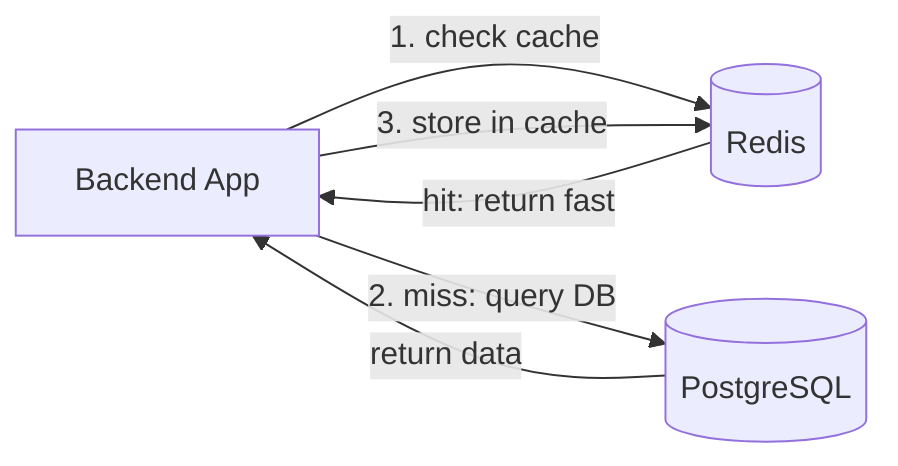
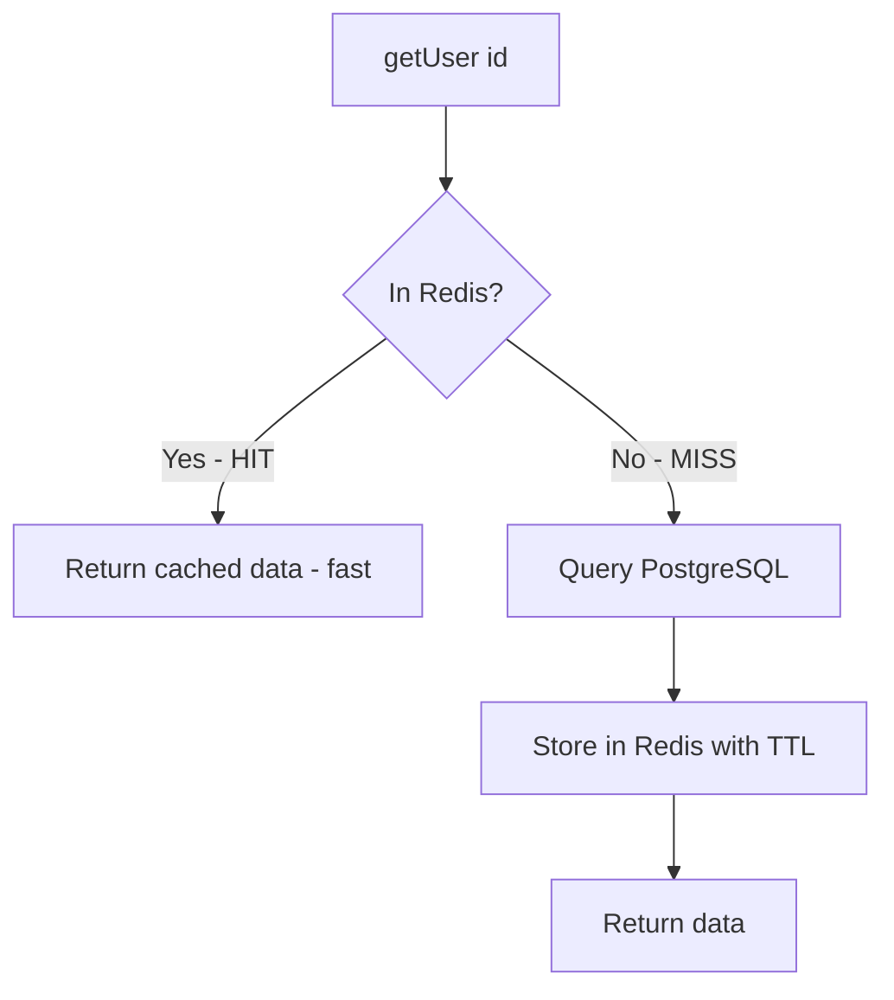
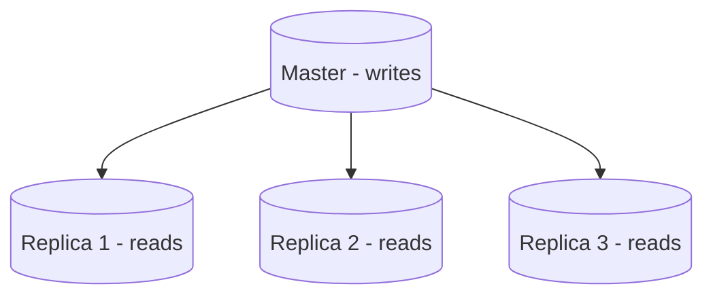
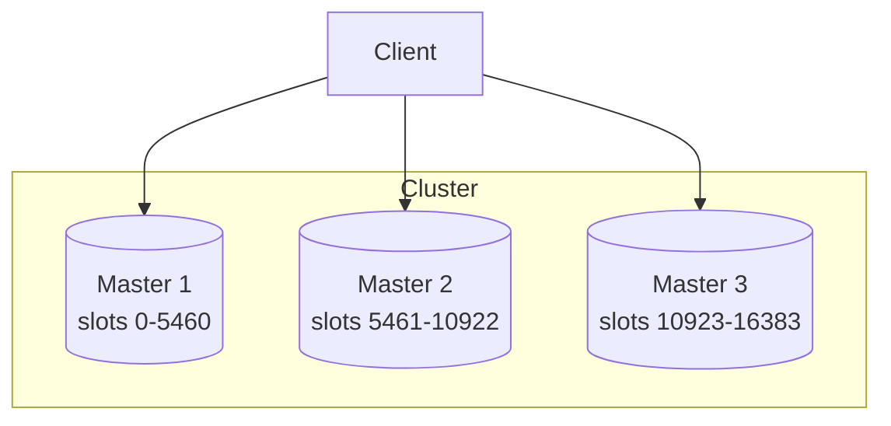

# Redis — Complete Guide (Beginner → Advanced)

This document explains Redis from the ground up — what it is, how it works, every major data structure, real use cases, and how this project uses it.

---

## Table of Contents

1. [Prerequisite Concepts](#1-prerequisite-concepts)
2. [What is Redis?](#2-what-is-redis)
3. [Why is Redis So Fast?](#3-why-is-redis-so-fast)
4. [Redis vs a Traditional Database](#4-redis-vs-a-traditional-database)
5. [Core Data Structures](#5-core-data-structures)
6. [Keys, Expiry (TTL), and Eviction](#6-keys-expiry-ttl-and-eviction)
7. [Persistence — RDB and AOF](#7-persistence--rdb-and-aof)
8. [Common Use Cases](#8-common-use-cases)
9. [Redis Pub/Sub and Streams](#9-redis-pubsub-and-streams)
10. [Atomicity, Transactions, and Lua](#10-atomicity-transactions-and-lua)
11. [Scaling Redis — Replication, Sentinel, Cluster](#11-scaling-redis--replication-sentinel-cluster)
12. [How This Project Uses Redis](#12-how-this-project-uses-redis)
13. [Interview Questions](#13-interview-questions)

---

## 1. Prerequisite Concepts

### RAM vs Disk

- **RAM (memory):** Extremely fast (nanoseconds), but volatile — data is lost when power is off. Limited size.
- **Disk (SSD/HDD):** Slower (microseconds to milliseconds), but persistent — data survives restarts. Large size.

Redis stores data primarily in **RAM**, which is why it's so fast and also why memory size matters.

### Key-value store

The simplest database model: store a value under a unique key, retrieve it by that key.

```
SET name "Vinay"      → stores "Vinay" under key "name"
GET name              → returns "Vinay"
```

### Cache

A temporary, fast storage layer that holds frequently-used data so you don't recompute or re-fetch it from a slow source (like a database).

### TTL (Time To Live)

How long a piece of data should live before being automatically deleted.

---

## 2. What is Redis?

**Redis** = **RE**mote **DI**ctionary **S**erver.

It is an **in-memory data structure store**. In plain terms: a database that keeps data in RAM and supports rich data types (not just strings, but lists, sets, hashes, sorted sets, and more).

It is most commonly used as:

- A **cache** (speed up apps by storing hot data in memory)
- A **session store** (hold login sessions / tokens)
- A **message broker** (pub/sub, streams, queues)
- A **rate limiter** (count requests per user)
- A **real-time leaderboard** (sorted sets)

### Key characteristics

| Characteristic         | Detail                                                              |
| ---------------------- | ------------------------------------------------------------------- |
| In-memory              | Data lives in RAM → microsecond response times                      |
| Single-threaded (core) | Commands run one at a time → no race conditions on a single command |
| Rich data types        | Strings, lists, sets, hashes, sorted sets, streams, bitmaps, etc.   |
| Optional persistence   | Can save to disk (RDB snapshots / AOF log)                          |
| Atomic operations      | Each command is atomic; supports transactions and Lua scripts       |

---

## 3. Why is Redis So Fast?

Redis can handle **100,000+ operations per second** on a single node. Three reasons:

### 1. It lives in RAM

Reading from RAM is ~100,000x faster than reading from a spinning disk and much faster than SSD.

```
RAM access:   ~100 nanoseconds
SSD access:   ~100 microseconds  (1000x slower)
HDD access:   ~10 milliseconds   (100,000x slower)
```

### 2. It is single-threaded (for command execution)

This sounds counter-intuitive, but it's a strength:

- No locks, no thread coordination overhead
- No race conditions between commands
- Commands execute one after another, predictably

> Modern Redis uses extra threads for I/O and background tasks, but **command execution** is still effectively serialized.

### 3. Efficient data structures and protocol

Redis uses optimized C data structures and a simple, fast binary protocol (RESP). Operations like "add to set" or "increment counter" are O(1).

---

## 4. Redis vs a Traditional Database

```
                    Redis                       PostgreSQL (RDBMS)
                ┌──────────────┐            ┌──────────────────────┐
Storage         │ RAM (fast)   │            │ Disk (durable)        │
Speed           │ microseconds │            │ milliseconds          │
Data model      │ key-value +  │            │ tables, rows, columns │
                │ structures   │            │ relationships, joins  │
Query language  │ commands     │            │ SQL                   │
Durability      │ optional     │            │ strong (ACID)         │
Use as          │ cache/session│            │ source of truth       │
                └──────────────┘            └──────────────────────┘
```

**They are not competitors — they work together.** PostgreSQL is the permanent source of truth; Redis is the fast layer in front of it.



This is the **cache-aside pattern** (see use cases below).

---

## 5. Core Data Structures

This is what makes Redis more than a simple key-value store. Each type has specialized commands.

### 5.1 Strings

The most basic type. A key maps to a string value (can hold text, numbers, JSON, binary up to 512MB).

```
SET user:1:name "Vinay"
GET user:1:name              → "Vinay"

SET counter 10
INCR counter                 → 11  (atomic increment)
INCRBY counter 5             → 16
DECR counter                 → 15

SET session "data" EX 300    → set with 300-second expiry
```

**Use cases:** caching values, counters, flags, storing serialized JSON.

### 5.2 Hashes

A key maps to a collection of field-value pairs (like a small object/dictionary).

```
HSET user:1 firstName "Vinay" lastName "Kumar" age "25"
HGET user:1 firstName        → "Vinay"
HGETALL user:1               → all fields and values
HINCRBY user:1 age 1         → increments age field
```

**Use cases:** storing objects (a user profile) without serializing the whole thing. You can update one field without rewriting everything.

### 5.3 Lists

An ordered collection of strings (a linked list). You can push/pop from both ends.

```
LPUSH queue "job1"           → add to left (head)
RPUSH queue "job2"           → add to right (tail)
LPOP queue                   → remove and return from left
RPOP queue                   → remove and return from right
LRANGE queue 0 -1            → get all elements
LLEN queue                   → length
```

**Use cases:** simple job queues (LPUSH + RPOP = FIFO queue), recent activity feeds, message buffers.

```
Producer:  LPUSH jobs "task"
Consumer:  BRPOP jobs 0        ← blocking pop, waits for a job
```

### 5.4 Sets

An unordered collection of **unique** strings (no duplicates).

```
SADD tags "redis" "database" "cache"
SADD tags "redis"            → ignored (already exists)
SMEMBERS tags                → all members
SISMEMBER tags "redis"       → 1 (true)
SCARD tags                   → 3 (count)

# Set operations
SINTER set1 set2             → intersection (common members)
SUNION set1 set2             → union
SDIFF set1 set2              → difference
```

**Use cases:** unique visitors, tags, "users who liked X", checking membership, mutual friends (intersection).

### 5.5 Sorted Sets (ZSet)

Like a set, but every member has a **score** used for ordering. Members are kept sorted by score.

```
ZADD leaderboard 100 "alice"
ZADD leaderboard 250 "bob"
ZADD leaderboard 175 "carol"

ZRANGE leaderboard 0 -1 WITHSCORES        → ascending order
ZREVRANGE leaderboard 0 2 WITHSCORES      → top 3 (descending)
ZRANK leaderboard "carol"                 → carol's position
ZINCRBY leaderboard 50 "alice"            → increase alice's score
```

**Use cases:** leaderboards, ranking, priority queues, time-ordered data (use timestamp as score), rate limiting (sliding window).

### 5.6 Other types (advanced)

| Type            | What it is                        | Use case                                         |
| --------------- | --------------------------------- | ------------------------------------------------ |
| **Bitmaps**     | Bit-level operations on strings   | Track daily active users (1 bit per user)        |
| **HyperLogLog** | Probabilistic unique counter      | Count millions of unique items using tiny memory |
| **Geospatial**  | Store and query coordinates       | "Find stations within 5km"                       |
| **Streams**     | Append-only log (like mini-Kafka) | Durable event streams, consumer groups           |

---

## 6. Keys, Expiry (TTL), and Eviction

### Key naming convention

Use colons to create namespaces (Redis has no folders, but this convention organizes keys):

```
user:1:profile
otp:session:abc-123
refresh:userId:deviceId
rate:limit:192.168.1.1
```

### Setting expiry (TTL)

```
SET session "data" EX 300        → expires in 300 seconds
EXPIRE existingKey 60            → set 60s TTL on an existing key
TTL session                      → seconds remaining (-1 = no expiry, -2 = gone)
PERSIST session                  → remove the expiry (make permanent)
```

When a key's TTL reaches zero, Redis automatically deletes it. This is perfect for sessions, OTPs, and caches.

### Eviction policies

When Redis runs out of memory (`maxmemory` reached), it must decide what to remove. You configure an **eviction policy**:

| Policy           | Behavior                                      |
| ---------------- | --------------------------------------------- |
| `noeviction`     | Reject new writes (return error)              |
| `allkeys-lru`    | Evict least recently used key (any key)       |
| `volatile-lru`   | Evict LRU key, but only keys with a TTL set   |
| `allkeys-lfu`    | Evict least frequently used key               |
| `volatile-ttl`   | Evict the key with the shortest remaining TTL |
| `allkeys-random` | Evict a random key                            |

**LRU (Least Recently Used)** is the most common for caching — it keeps "hot" data and drops "cold" data.

---

## 7. Persistence — RDB and AOF

Redis is in-memory, but it can save to disk so data survives restarts. Two mechanisms:

### RDB (Redis Database) — Snapshots

Periodically saves a point-in-time snapshot of all data to a single file (`dump.rdb`).

```
Pros: compact file, fast restart, good for backups
Cons: you can lose data since the last snapshot (e.g. last 5 minutes)
Config: SAVE 900 1   → snapshot if ≥1 key changed in 900 seconds
```

### AOF (Append Only File) — Command log

Logs every write command. On restart, Redis replays the log to rebuild the data.

```
Pros: more durable (can lose <1 second of data with fsync=everysec)
Cons: larger files, slightly slower than RDB
Config: appendfsync everysec   → fsync to disk every second
```

### Which to use?

- **Cache only, data is disposable:** disable persistence (fastest)
- **Need durability:** use AOF, or AOF + RDB together (recommended for important data)
- Most production setups use **both**: RDB for fast backups, AOF for durability.

---

## 8. Common Use Cases

### 8.1 Caching (Cache-Aside Pattern)

The most common use. Check cache first; on miss, query DB and populate cache.

```js
async function getUser(id) {
  // 1. Try cache
  const cached = await redis.get(`user:${id}`);
  if (cached) return JSON.parse(cached); // cache HIT

  // 2. Cache miss → query DB
  const user = await db.user.findUnique({where: {id}});

  // 3. Store in cache for next time (with TTL)
  await redis.set(`user:${id}`, JSON.stringify(user), 'EX', 3600);

  return user;
}
```



### 8.2 Session / Token Storage

Store login sessions or refresh-token IDs with automatic expiry. (This project does this.)

```
SET refresh:userId:deviceId "jti-value" EX 604800
```

### 8.3 Rate Limiting

Limit how many requests a user can make. (This project does this for OTP.)

```js
// Fixed window rate limit: max 5 per hour
const count = await redis.incr(`rate:${email}`);
if (count === 1) await redis.expire(`rate:${email}`, 3600);
if (count > 5) throw new Error('Rate limit exceeded');
```

### 8.4 Distributed Lock

Prevent two processes from doing the same thing at once.

```
SET lock:resource "owner-id" NX EX 10
# NX = only set if not exists. If it succeeds, you hold the lock for 10s.
```

### 8.5 Leaderboards (Sorted Sets)

```
ZADD game:scores 5000 "player1"
ZREVRANGE game:scores 0 9 WITHSCORES    → top 10 players
```

### 8.6 Real-time counters

```
INCR page:views:home          → atomic, no race conditions
```

---

## 9. Redis Pub/Sub and Streams

### Redis Pub/Sub (ephemeral)

Built-in publish/subscribe for real-time messaging. Messages are **not stored** — offline subscribers miss them. (Full details in [pub-sub.md](pub-sub.md).)

```
# Terminal 1 (subscriber)
SUBSCRIBE news

# Terminal 2 (publisher)
PUBLISH news "Breaking story!"
```

### Redis Streams (durable)

A more powerful, **append-only log** data type (similar to Kafka, but simpler). Messages are persisted and can be replayed. Supports **consumer groups** (load balancing among consumers).

```
XADD mystream * sensor "temp" value "25"   → append an entry (auto ID)
XREAD COUNT 10 STREAMS mystream 0          → read entries
XGROUP CREATE mystream group1 0            → create consumer group
XREADGROUP GROUP group1 consumer1 COUNT 1 STREAMS mystream >
```

|                  | Redis Pub/Sub      | Redis Streams      |
| ---------------- | ------------------ | ------------------ |
| Persistence      | ❌ No              | ✅ Yes             |
| Replay           | ❌ No              | ✅ Yes             |
| Consumer groups  | ❌ No              | ✅ Yes             |
| Offline catch-up | ❌ No              | ✅ Yes             |
| Use for          | Live notifications | Durable event logs |

---

## 10. Atomicity, Transactions, and Lua

### Atomic commands

Each Redis command is atomic — it completes fully without interruption. `INCR` is safe even with thousands of concurrent clients because Redis runs commands one at a time.

### Transactions (MULTI / EXEC)

Group multiple commands to run together without interruption.

```
MULTI            → start transaction
SET a 1
INCR a
EXEC             → execute all atomically (nothing runs in between)
```

> Note: Redis transactions don't roll back on logical errors like SQL does. They guarantee the commands run together, uninterrupted.

### Lua scripting

For complex atomic logic, run a Lua script on the server. The entire script executes atomically.

```lua
-- Atomic "check and set" rate limiter
local current = redis.call('INCR', KEYS[1])
if current == 1 then
  redis.call('EXPIRE', KEYS[1], ARGV[1])
end
return current
```

This avoids race conditions between INCR and EXPIRE by combining them into one atomic operation.

---

## 11. Scaling Redis — Replication, Sentinel, Cluster

### Replication (master-replica)

One **master** handles writes; multiple **replicas** copy its data and serve reads.



Benefits: read scaling, data redundancy. If the master fails, a replica can be promoted.

### Redis Sentinel — High Availability

Sentinel processes monitor the master. If the master dies, Sentinel automatically promotes a replica to master (automatic failover) and reconfigures clients.

```
Sentinels watch → master dies → elect new master → clients redirected
```

### Redis Cluster — Horizontal Scaling (Sharding)

When data is too big for one machine, **Cluster** splits (shards) data across multiple masters using **hash slots** (16,384 slots). Each master owns a range of slots.



A key's slot is determined by `CRC16(key) mod 16384`. The client routes each key to the correct master.

---

## 12. How This Project Uses Redis

The `user-service` already uses Redis heavily. Here is the complete map:

### Redis keys in this project

| Key pattern                   | Type             | Purpose                                        | TTL          |
| ----------------------------- | ---------------- | ---------------------------------------------- | ------------ |
| `otp:session:<uuid>`          | String (JSON)    | Stores `{hashedOtp, meta}` during registration | 300s         |
| `otp_rate:<email>`            | String (counter) | Limits OTP sends to 5/hour                     | 3600s        |
| `otp:attempts:<email>`        | String (counter) | Limits wrong OTP attempts to 5                 | 300s         |
| `refresh:<userId>:<deviceId>` | String           | Stores active refresh token JTI per device     | 604800s (7d) |
| `user:<userId>`               | String (JSON)    | Caches user profile to avoid DB lookups        | 86400s (24h) |

### Where each is used

```
Registration (otp.js):
  generateAndStoreOtp → SET otp:session, INCR otp_rate
  verifyOtp           → GET otp:session, INCR otp:attempts, DEL on success

Login (auth.service.js):
  SET refresh:<userId>:<deviceId> = jti      ← session tracking
  SET user:<userId> = profile                ← cache

Token rotation (auth.service.js):
  GET refresh:<userId>:<deviceId>            ← verify JTI
  SET refresh:<userId>:<deviceId> = newJti   ← rotate
```

### The singleton connection

This project uses a singleton Redis client (`src/config/redis.js`) so only one connection is opened and reused everywhere. See [docs/config/README.md](../config/README.md).

### Patterns demonstrated in this project

- **TTL-based expiry** — OTP sessions auto-expire
- **Atomic counters** — `INCR` for rate limiting
- **Session storage** — refresh token JTIs
- **Cache-aside** — user profile caching

---

## 13. Interview Questions

**Q: What is Redis and why is it fast?**
An in-memory key-value data structure store. Fast because data is in RAM, command execution is single-threaded (no lock overhead), and it uses efficient data structures.

**Q: Redis vs a relational database?**
Redis is in-memory, fast, key-value + structures, optionally durable — used as cache/session/broker. RDBMS is disk-based, durable, relational with SQL — used as the source of truth. They complement each other.

**Q: Name the core Redis data types and a use case for each.**
String (cache/counter), Hash (object storage), List (queue), Set (unique items), Sorted Set (leaderboard), Stream (durable event log).

**Q: How does Redis handle expiry?**
Keys can have a TTL. Redis uses lazy expiry (delete on access if expired) + active expiry (background sampling) to remove expired keys.

**Q: What is the cache-aside pattern?**
Check cache first; on miss, read from DB and write the result back to cache with a TTL.

**Q: How does Redis persist data?**
RDB (periodic snapshots) and AOF (append-only command log). Can use either or both.

**Q: Is Redis single-threaded? Isn't that slow?**
Command execution is effectively single-threaded, which removes locking overhead and race conditions. It's still extremely fast because everything is in RAM. I/O uses additional threads in modern versions.

**Q: How do you scale Redis?**
Replication (read scaling + redundancy), Sentinel (automatic failover/HA), Cluster (sharding data across multiple masters via hash slots).

**Q: How would you implement rate limiting with Redis?**
INCR a per-user key; set EXPIRE on first increment; reject when count exceeds the limit. Or use a sorted set for sliding-window limiting.

**Q: Redis Pub/Sub vs Streams?**
Pub/Sub is ephemeral (no storage, no replay). Streams are durable append-only logs with consumer groups and replay — closer to Kafka.

**Q: What's a distributed lock in Redis?**
`SET key value NX EX ttl` — sets the key only if it doesn't exist, with a timeout, so only one process holds the lock at a time (Redlock for multi-node).

**Q: What is an eviction policy?**
The rule Redis uses to remove keys when memory is full (e.g. `allkeys-lru` removes least recently used keys).
