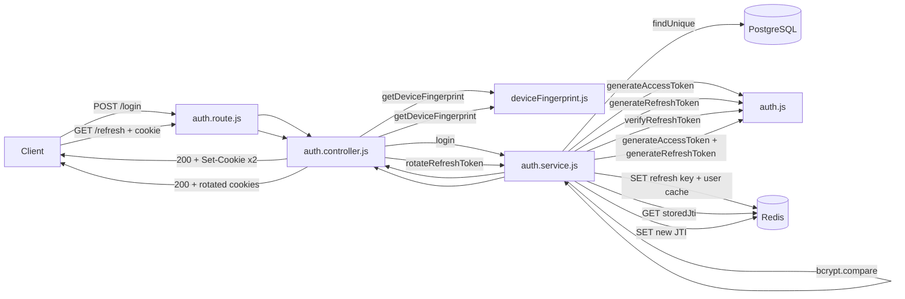

# Login and Token Rotation Flow

This document explains how user authentication and session management works after registration.

There are two endpoints:

- `POST /api/v1/auth/login` — verify credentials, issue tokens
- `GET /api/v1/auth/refresh` — silently rotate tokens when the access token expires

---

## Concepts you need to understand first

### Access token vs. refresh token

| Property  | Access Token                    | Refresh Token                                  |
| --------- | ------------------------------- | ---------------------------------------------- |
| Lifetime  | 15 minutes                      | 7 days                                         |
| Purpose   | Prove identity on each API call | Get a new access token when it expires         |
| Stored in | `httpOnly` cookie               | `httpOnly` cookie                              |
| Secret    | `JWT_ACCESS_SECRET`             | `JWT_REFRESH_SECRET`                           |
| Redis key | Not stored in Redis             | Stored as JTI in `refresh:<userId>:<deviceId>` |

### Why `httpOnly` cookies?

`httpOnly` cookies cannot be read by JavaScript (`document.cookie`). This prevents XSS attacks from stealing your tokens. The browser automatically includes them on matching requests.

### What is a JTI?

JTI = JWT ID. It is a unique identifier embedded in every refresh token payload when it is created (`crypto.randomUUID()`). It is used to track **which specific refresh token is currently valid** for a given user+device pair.

### What is device fingerprinting?

Each request is assigned a `deviceId` computed from:

```
SHA-256(User-Agent + "|" + IP + "|" + Accept header).slice(0, 16)
```

This 16-character hex string is used as part of the Redis key: `refresh:<userId>:<deviceId>`. Different devices → different keys → independent sessions.

---

## Login Flow — `POST /api/v1/auth/login`

### Request

```http
POST /api/v1/auth/login
Content-Type: application/json
```

```json
{
  "email": "vinay@example.com",
  "password": "Password@123"
}
```

### Step-by-step

```
Controller (auth.controller.js)
  │
  ├─ Validate: email and password present → else 400 BAD_REQUEST
  ├─ Derive deviceId = getDeviceFingerprint(req)
  │
  └─ Call authService.login(email, password, deviceId)

Service (auth.service.js)
  │
  ├─ prisma.user.findUnique({ where: { email } })
  │     └─ not found → throw BadRequestError("Invalid email or password") → 400
  │
  ├─ bcrypt.compare(password, user.password)
  │     └─ mismatch → throw BadRequestError("Invalid password") → 400
  │
  ├─ generateAccessToken(userId)
  │     └─ JWT { id: userId } signed with JWT_ACCESS_SECRET, expires 15m
  │
  ├─ generateRefreshToken(userId)
  │     └─ JWT { id: userId, jti: uuid } signed with JWT_REFRESH_SECRET, expires 7d
  │
  ├─ jwt.decode(refreshToken) → extract jti
  ├─ Redis.set(`refresh:${userId}:${deviceId}`, jti, EX 604800)
  ├─ Redis.set(`user:${userId}`, JSON.stringify(safeUser), EX 86400)
  │     └─ safeUser = user object without the password field
  │
  └─ Return { accessToken, refreshToken, loggedInUser }

Controller
  ├─ res.cookie("accessToken",  ..., httpOnly+secure+strict, maxAge 900s)
  ├─ res.cookie("refreshToken", ..., httpOnly+secure+strict, maxAge 604800s)
  └─ res.status(200).json({ success: true, message: "Login successful", data: { loggedInUser } })
```

### Response

```json
{
  "success": true,
  "message": "Login successful",
  "data": {
    "loggedInUser": {
      "id": "uuid",
      "firstName": "Vinay",
      "lastName": "Kumar",
      "email": "vinay@example.com",
      "emailVerified": true,
      "createdAt": "2026-06-27T10:00:00.000Z",
      "updatedAt": "2026-06-27T10:00:00.000Z"
    }
  }
}
```

Two `Set-Cookie` headers are also set in the response.

### Redis state after login

```
refresh:<userId>:<deviceId>   =  <jti-string>    TTL: 604800s (7 days)
user:<userId>                 =  <user-json>     TTL: 86400s  (24 hours)
```

---

## Token Rotation Flow — `GET /api/v1/auth/refresh`

This is called automatically by the client when the access token expires (after 15 minutes). The client sends the refresh token cookie, and gets fresh tokens back.

### Request

```http
GET /api/v1/auth/refresh
Cookie: refreshToken=<token>
```

No body needed.

### Step-by-step

```
Controller (auth.controller.js)
  │
  ├─ Read req.cookies.refreshToken
  │     └─ missing → throw UnauthorizedError("Refresh token is missing") → 401
  │
  ├─ Derive deviceId = getDeviceFingerprint(req)
  └─ Call authService.rotateRefreshToken(refreshToken, deviceId)

Service (auth.service.js)
  │
  ├─ verifyRefreshToken(refreshToken)
  │     └─ expired/invalid signature → jwt throws → 500 (unhandled, should be caught as 401)
  │     └─ returns { id: userId, jti }
  │
  ├─ Redis.get(`refresh:${userId}:${deviceId}`) → storedJti
  │
  ├─ if storedJti is null
  │     └─ throw ForbiddenError("Session expired. Please login again.") → 403
  │
  ├─ if storedJti !== jti
  │     ├─ Redis.del(`refresh:${userId}:${deviceId}`)   ← destroy the compromised session
  │     └─ throw ForbiddenError("Refresh token has been rotated. Please login again.") → 403
  │
  ├─ generateAccessToken(userId)  → new access token
  ├─ generateRefreshToken(userId) → new refresh token with new jti
  ├─ Redis.set(`refresh:${userId}:${deviceId}`, newJti, EX 604800)
  └─ Return { newAccessToken, newRefreshToken }

Controller
  ├─ res.cookie("accessToken",  newAccessToken,  ...)
  ├─ res.cookie("refreshToken", newRefreshToken, ...)
  └─ res.status(200).json({ success: true, message: "Refresh token rotated successfully..." })
```

### Response

```json
{
  "success": true,
  "message": "Refresh token rotated successfully, access n refresh token reissued"
}
```

Both cookies are replaced with fresh tokens.

---

## Token rotation: why it matters

Every time `GET /refresh` is called, the old refresh token is **invalidated** and a new one is issued. The Redis JTI is updated.

```
Before rotation:
  Redis: refresh:<userId>:<deviceId> = "jti-A"
  Client cookie: refreshToken with jti-A

After rotation:
  Redis: refresh:<userId>:<deviceId> = "jti-B"
  Client cookie: refreshToken with jti-B

jti-A is now invalid. If someone tries to use it:
  → Redis returns jti-B, which != jti-A
  → Redis key is DELETED (session killed)
  → 403 FORBIDDEN
  → User must log in again
```

This is called **refresh token rotation with reuse detection**. It protects against stolen refresh tokens.

---

## Reuse attack scenario explained

```
1. Attacker steals refresh token with jti-A from the user
2. User legitimately calls /refresh → gets jti-B (jti-A no longer valid in Redis)
3. Attacker tries to use jti-A:
   - Redis has jti-B, incoming is jti-A → MISMATCH
   - Redis key deleted → user's session is killed
   - Attacker gets 403
4. User tries to use jti-B (their valid cookie):
   - Redis has no key anymore → storedJti is null → 403
   - User is forced to re-login
```

The user is inconvenienced (must log in again), but the attacker never gains access.

---

## Multi-device session isolation

Because the Redis key includes `deviceId`:

```
refresh:<userId>:abc123def456  ← phone session
refresh:<userId>:9f8e7d6c5b4a  ← laptop session
```

- Rotating on the phone does not affect the laptop session
- A stolen token from the phone cannot be used from the laptop (different fingerprint = different key = not found in Redis)

---

## All possible error responses

| Scenario                                 | Status | `error` code   | Message                                               |
| ---------------------------------------- | ------ | -------------- | ----------------------------------------------------- |
| Missing email/password                   | `400`  | `BAD_REQUEST`  | "Email and password are required"                     |
| User not found                           | `400`  | `BAD_REQUEST`  | "Invalid email or password"                           |
| Wrong password                           | `400`  | `BAD_REQUEST`  | "Invalid password"                                    |
| Missing refresh token cookie             | `401`  | `UNAUTHORIZED` | "Refresh token is missing"                            |
| Session expired (key deleted from Redis) | `403`  | `FORBIDDEN`    | "Session expired. Please login again."                |
| Refresh token reuse detected             | `403`  | `FORBIDDEN`    | "Refresh token has been rotated. Please login again." |

---

## Architecture diagram



---

## Testing in Postman

### Login

1. `POST /api/v1/auth/login` with `{ email, password }`
2. Postman will receive `Set-Cookie` headers — enable cookie handling in Postman
3. You will see the `accessToken` and `refreshToken` cookies in Postman's cookie jar

### Refresh

1. With the cookies in place, call `GET /api/v1/auth/refresh`
2. The old cookies are replaced by new ones
3. Try calling it again immediately — it works (new tokens issued)
4. If you manually delete the Redis key and retry — you get `403`
