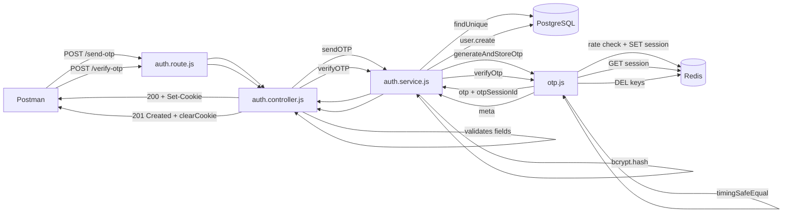

# Registration Flow: Send OTP + Verify OTP

This document is a complete, detailed walkthrough of how user registration works in `user-service`.

Registration is a **two-step flow**:

1. `POST /api/v1/auth/send-otp` — validate input, store OTP session in Redis
2. `POST /api/v1/auth/verify-otp` — verify OTP, create user in PostgreSQL

---

## Why two steps?

Email verification proves the user owns the email address before a DB record is created. The OTP session bridges the two requests — it temporarily holds the registration data in Redis until the OTP is confirmed.

---

## Files involved

| Layer         | File                                 | Role                                                       |
| ------------- | ------------------------------------ | ---------------------------------------------------------- |
| Route         | `src/routes/auth.route.js`           | Registers the two endpoints                                |
| Controller    | `src/controllers/auth.controller.js` | HTTP layer: validates fields, sets cookies, sends response |
| Service       | `src/service/auth.service.js`        | Business logic: duplicate check, bcrypt, Prisma create     |
| OTP helper    | `src/utils/otp.js`                   | Generate OTP, HMAC hash, Redis store/verify                |
| Auth error    | `src/utils/error.js`                 | Typed error classes used for all failures                  |
| Async handler | `src/utils/asyncHandler.js`          | Propagates thrown errors to error middleware               |
| Redis client  | `src/config/redis.js`                | Singleton Redis connection                                 |
| Config        | `src/config/index.js`                | OTP TTL, rate limits, HMAC secret                          |

---

## Step 1 — `POST /api/v1/auth/send-otp`

### Request

```http
POST /api/v1/auth/send-otp
Content-Type: application/json
```

```json
{
  "firstName": "Vinay",
  "lastName": "Kumar",
  "email": "vinay@example.com",
  "password": "Password@123",
  "confirmPassword": "Password@123"
}
```

### Controller validation (`auth.controller.js`)

| Check                          | Failure                                       | Status |
| ------------------------------ | --------------------------------------------- | ------ |
| All 5 fields present           | `BadRequestError("All fields are mandatory")` | `400`  |
| `password === confirmPassword` | `BadRequestError("Password mismatch")`        | `400`  |

### Service logic (`auth.service.js → sendOTP`)

1. `prisma.user.findUnique({ where: { email } })` — if user found → `ConflictError` `409`
2. `bcrypt.hash(password, 12)` — hash the password before storing it anywhere
3. Build `meta` object: `{ firstName, lastName, email, hashedPassword }`
4. Call `generateAndStoreOtp(meta)` in `otp.js`

### OTP generation (`otp.js → generateAndStoreOtp`)

1. `Redis.get(otp_rate:<email>)` → if count >= 5 → `TooManyRequestsError` `429`
2. Generate 6-digit numeric OTP with `otp-generator`
3. `otpSessionId = crypto.randomUUID()`
4. `hashedOtp = HMAC-SHA256(OTP_HMAC_SECRET, email + ":" + otp)`
5. `Redis.set(otp:session:<otpSessionId>, {hashedOtp, meta}, EX 300)`
6. `Redis.incr(otp_rate:<email>)`, `Redis.expire(otp_rate:<email>, 3600)`
7. Return `{ otp, otpSessionId }`

### Response

```json
{
  "success": true,
  "message": "OTP generated successfully",
  "data": {
    "otpSessionId": "550e8400-e29b-41d4-a716-446655440000",
    "otp": "482951"
  }
}
```

The `otp` field is **only included when `NODE_ENV !== "production"`**. In production, the OTP would be sent by email only.

The controller also sets a cookie:

```
Set-Cookie: otp_session=<otpSessionId>; HttpOnly; SameSite=Lax; Max-Age=300
```

This cookie is an alternative way to pass the `otpSessionId` to the verify step, useful for browser-based flows.

---

## Step 2 — `POST /api/v1/auth/verify-otp`

### Request

```http
POST /api/v1/auth/verify-otp
Content-Type: application/json
```

```json
{
  "otp": "482951",
  "otpSessionId": "550e8400-e29b-41d4-a716-446655440000"
}
```

The `otpSessionId` can be provided in:

- The request body (`otpSessionId` field) — preferred in Postman
- The `otp_session` cookie — used in browser flows

### Controller validation

| Check                              | Failure           | Status |
| ---------------------------------- | ----------------- | ------ |
| `otp` present                      | `BadRequestError` | `400`  |
| `otpSessionId` from body or cookie | `BadRequestError` | `400`  |

### OTP verification (`otp.js → verifyOtp`)

1. `Redis.get(otp:session:<otpSessionId>)` → if `null` → service returns `BadRequestError` `400 OTP_INVALID`
2. Parse `{ hashedOtp, meta }` from Redis value
3. `Redis.get(otp:attempts:<email>)` → if count >= 5 → `TooManyRequestsError` `429`
4. Compute `HMAC-SHA256(secret, email + ":" + incomingOtp)` → `incomingHash`
5. `crypto.timingSafeEqual(incomingHash, storedHash)`

**If OTP is valid:**

- `Redis.del(otp:session:<otpSessionId>)` — invalidate session
- `Redis.del(otp:attempts:<email>)` — clear attempt counter
- `Redis.del(otp_rate:<email>)` — clear rate limit
- Return `meta`

**If OTP is invalid:**

- `Redis.incr(otp:attempts:<email>)`, `Redis.expire(otp:attempts:<email>, 300)`
- Return `null` → service throws `BadRequestError("Invalid or expired OTP", "OTP_INVALID")`

### User creation (`auth.service.js → verifyOTP`)

After OTP verified:

1. `prisma.user.findUnique(email)` — race-condition safety check
2. `prisma.user.create({ firstName, lastName, email, password: hashedPassword, emailVerified: true })`
3. Return the newly created user

### Response

```json
{
  "success": true,
  "message": "User Account created successfully",
  "data": {
    "id": "uuid",
    "firstName": "Vinay",
    "lastName": "Kumar",
    "email": "vinay@example.com",
    "emailVerified": true,
    "createdAt": "2026-06-27T10:00:00.000Z",
    "updatedAt": "2026-06-27T10:00:00.000Z"
  }
}
```

Status code: **`201 Created`**

The `otp_session` cookie is cleared by the controller (`res.clearCookie("otp_session")`).

---

## Complete Redis state walkthrough

```
After send-otp:
  otp:session:<uuid>    = {hashedOtp: "abc...", meta: {...}}   TTL: 300s
  otp_rate:<email>      = 1                                    TTL: 3600s

After wrong verify attempt:
  otp:session:<uuid>    = unchanged
  otp:attempts:<email>  = 1                                    TTL: 300s

After correct verify:
  otp:session:<uuid>    = DELETED
  otp:attempts:<email>  = DELETED
  otp_rate:<email>      = DELETED
```

---

## All possible error responses

| Scenario                 | Status | `error` code        | Message                                      |
| ------------------------ | ------ | ------------------- | -------------------------------------------- |
| Missing fields           | `400`  | `BAD_REQUEST`       | "All fields are mandatory"                   |
| Password mismatch        | `400`  | `BAD_REQUEST`       | "Password mismatch"                          |
| Email already exists     | `409`  | `CONFLICT`          | "User already exists"                        |
| OTP send rate exceeded   | `429`  | `TOO_MANY_REQUESTS` | "OTP request limit exceeded..."              |
| Missing otp or sessionId | `400`  | `BAD_REQUEST`       | "OTP or otpSessionId is missing..."          |
| Wrong or expired OTP     | `400`  | `OTP_INVALID`       | "Invalid or expired OTP"                     |
| Too many wrong attempts  | `429`  | `TOO_MANY_REQUESTS` | "Maximum OTP verification attempts exceeded" |

---

## Architecture diagram



---

## Testing in Postman

1. `POST /api/v1/auth/send-otp` with signup body
2. Copy `otpSessionId` and `otp` from the `data` field in the response
3. `POST /api/v1/auth/verify-otp` with `{ otp, otpSessionId }`
4. `201` response means the user was created in PostgreSQL
5. Verify in Prisma Studio: `npm run prisma:studio`

---

## Important notes

- In development mode, the OTP is returned in the response. In production it would be sent by email.
- The plain OTP is never stored — only its HMAC hash. Even if Redis is compromised, raw OTPs cannot be read back.
- The session ID (`otpSessionId`) is required for verification. Knowing only the 6-digit OTP is not enough.
- OTP sessions expire after 300 seconds (5 minutes) by default.
